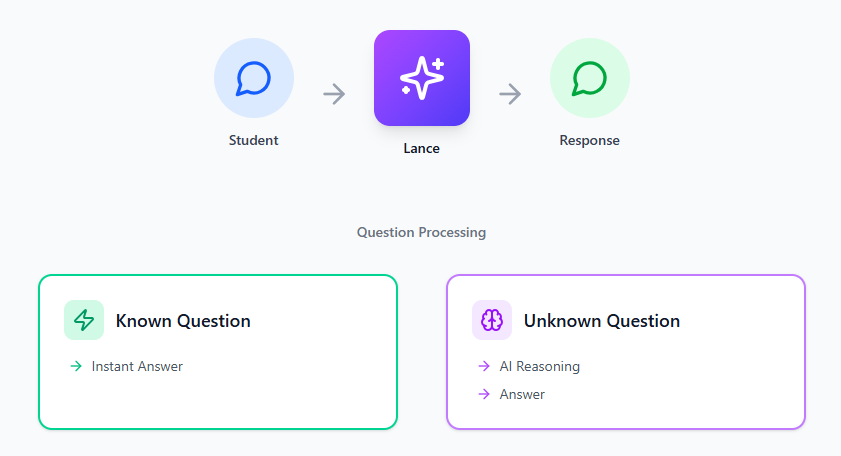
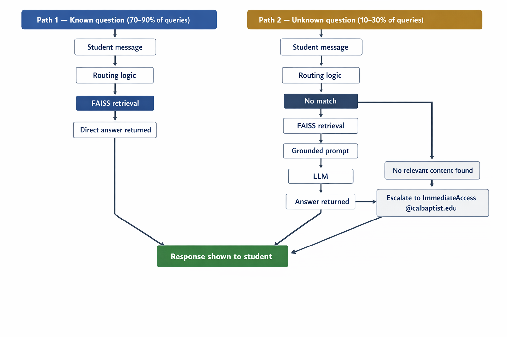
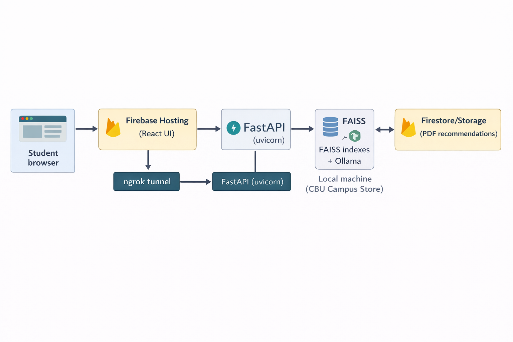

# Lance - Start Here

> **Who this document is for:** Anyone new to the Lance project - whether you are a Campus Store staff member taking over content management, an IT staff member managing the server, or a developer picking up where development left off. Read this document first before reading anything else.

---

## 1. What is Lance?

Lance is a chatbot built specifically for the CBU Campus Store. Students can access it through a web browser and ask questions about their Immediate Access digital textbooks - things like "I can't access my Cengage textbook" or "How do I clear my browser cache?" Lance reads the question, finds the most relevant answer from a library of pre-written content, and responds instantly.

Lance was built to reduce the volume of repetitive support emails that the Campus Store receives every semester, especially during the first two weeks of classes when Immediate Access issues spike. It handles 12 publisher platforms: Cengage MindTap, McGraw Hill Connect, Pearson MyLab/Mastering, WileyPlus, Bedford/VitalSource Bookshelf, ZyBooks, Sage Vantage, Macmillan Achieve, SimuCase, Norton/InQuizitive, Stukent, and CliftonStrengths.

Lance does not replace the Campus Store team. When it cannot answer a question, it directs students to contact ImmediateAccess@calbaptist.edu.

---

## 2. How Lance works - the 30-second version

A student types a question. Lance checks whether the question matches any of its pre-written content. If it does, it returns the answer immediately - no AI involved, just a fast lookup. If the question is unfamiliar, Lance retrieves the most relevant content it has and uses an AI model to reason over it and form an answer. If it genuinely cannot find anything useful, it escalates to the Campus Store team.

That's the entire system. The technical details below explain how each piece works, but the core idea is simple: pre-written answers first, AI reasoning as a backup, human escalation as a last resort.

---

## 3. Who maintains what

| Role | Responsibilities | Primary guide to read |
|---|---|---|
| **Campus Store staff** | Add new FAQ content, update seasonal information (refund deadlines, rental return dates), manage the FAQ sidebar, use the Admin UI | `02_campus_store_handoff.md` |
| **IT staff** | Server setup, network configuration, keeping Ollama and uvicorn running, migrating from ngrok to a permanent network solution | `01_IT_handoff.md` |
| **Developer (if needed)** | Routing logic fixes, adding new detection functions, debugging wrong answers, new features | `09_core_scripts.md` + `03_rag_system.md` |

> If you are not sure which role applies to you, Campus Store staff should start with `02_campus_store_handoff.md`. IT staff should start with `01_IT_handoff.md`. When in doubt, read this document first and follow the links.

---

## 4. How Lance actually works - the full picture

**Path 1 - Deterministic routing (fast, no AI):**
Lance has a library of pre-written content files - platform access instructions, browser cache guides, return policies, store hours, and more. When a student asks a question, Lance uses keyword detection and a vector search system called FAISS to find the most relevant content file. If the match is strong enough, it returns the answer directly. This takes 1-50 milliseconds and involves no AI generation whatsoever. This path handles the vast majority of real student questions.

**Path 2 - Grounded LLM fallback (slower, uses AI):**
When no pre-written content closely matches the question, Lance retrieves the most relevant content it can find and passes it to a local AI model (Ollama, configured via `PRIMARY_LLM_MODEL` in `.env`). The AI is strictly instructed to answer only from the retrieved content - it cannot make things up or use outside knowledge. If the retrieved content is too weak to support an answer, Lance skips the AI entirely and escalates to the Campus Store team instead.

This design means Lance is reliable for well-covered topics and honest about its limitations for everything else.

---

## 5. The tech stack at a glance

You do not need to understand every component to maintain Lance. This table shows what each piece does and where to learn more.

| Component | What it is | What it does | Learn more |
|---|---|---|---|
| **FastAPI** | Python web framework | Handles all student chat requests, runs the routing logic | `09_core_scripts.md` |
| **FAISS** | Vector search library | Finds the most relevant content for any given question | `03_rag_system.md` |
| **Ollama + local LLM** | Local AI model | Handles edge case questions the routing logic can't answer | `06_hosting_guide.md` |
| **React frontend** | The chat UI | What students see and interact with in their browser | `05_ui_guide.md` |
| **Firebase Hosting** | Google's web hosting | Hosts the chat UI at a public URL | `06_hosting_guide.md` |
| **Firestore + Storage** | Google's database | Stores PDF guides shown in the right sidebar | `07_firestore_pdf_guide.md` |
| **Admin UI** | A web page for staff | Lets Campus Store staff add or remove content without coding | `08_admin_ui_guide.md` |
| **ngrok** | Network tunnel (interim) | Temporarily exposes the backend to the internet | `06_hosting_guide.md` |
| **Content `.txt` files** | Plain text files | The actual answers Lance gives to students | `04_dataset_guide.md` |

---

## 6. Where to go from here

**If you are Campus Store staff:**
1. Read `02_campus_store_handoff.md` - this covers everything you need for day-to-day operations
2. Read `08_admin_ui_guide.md` - how to add and remove content
3. Read `11_seasonal_maintenance.md` - what to update at the start of each semester
4. Keep `10_troubleshooting.md` bookmarked for when things go wrong

**If you are IT staff:**
1. Read `01_IT_handoff.md` - server setup, Ollama, uvicorn, restart procedures
2. Read `06_hosting_guide.md` - current ngrok setup and the plan to migrate to a permanent network solution
3. Read `docs/environment-reference.md` and `docs/backup-restore-procedure.md`
4. Keep `10_troubleshooting.md` bookmarked for when things go wrong

**If you are a developer:**
1. Read `03_rag_system.md` - how ingestion and retrieval works
2. Read `09_core_scripts.md` - main.py routing logic and llama_client.py
3. Read `04_dataset_guide.md` - how content files are structured
4. Read `docs/production-hardening-checklist.md` and `docs/manual-qa-checklist.md`
5. The `README.md` in the project root has a full reference of routing functions and content files

**If you are reviewing Phase 1-6 readiness before more development:**
1. Read `docs/production-hardening-checklist.md`
2. Run `scripts/phase7_regression.ps1`
3. Use `docs/manual-qa-checklist.md` for browser/admin validation

---

## 7. Current deployment status

| Item | Current status | Notes |
|---|---|---|
| Chat UI | Live on Firebase Hosting | Accessible via Firebase public URL |
| Backend API | Running via uvicorn | On the local Campus Store machine |
| LLM fallback | Active | Ollama + llama3.2 running locally |
| Network tunnel | ngrok (interim) | Needs to be replaced with a permanent CBU IT solution |
| Hardware | Current machine is slow for LLM | Upgrade to Mac mini M4 Pro 48GB recommended |
| CBU IT migration | Not started | Static IP, DNS hostname, reverse proxy, HTTPS needed |
| Docker containerization | Planned | Timing to be decided alongside IT migration |

The most important pending item is the **CBU IT network migration**. The current ngrok tunnel is free-tier and not suitable for permanent production use. This needs a conversation with CBU IT to assign a static IP address, DNS hostname, and set up a proper reverse proxy with HTTPS.

---

## 8. Key contacts

| Purpose | Contact |
|---|---|
| Student Immediate Access issues (escalation) | ImmediateAccess@calbaptist.edu |
| General Campus Store questions | cscontact@calbaptist.edu / 951-343-4259 |
| Lance development questions (handoff period) | Haneul - CBU Campus Store intern |
| CBU IT network migration | CBU IT department |
| Firebase / Google Cloud issues | Firebase console at console.firebase.google.com (project: `lance-cbu`) |

---

## 9. The one thing that breaks most often

Lance's content goes stale. At the start of every semester, the textbook refund deadlines in `textbook_refund_policy.txt` and the rental return deadline in `campus_store_textbook_rentals.txt` need to be updated to reflect the new semester dates. If these are not updated, Lance will give students wrong deadline information.

See `11_seasonal_maintenance.md` for the complete checklist of what to update each semester and how to do it.
