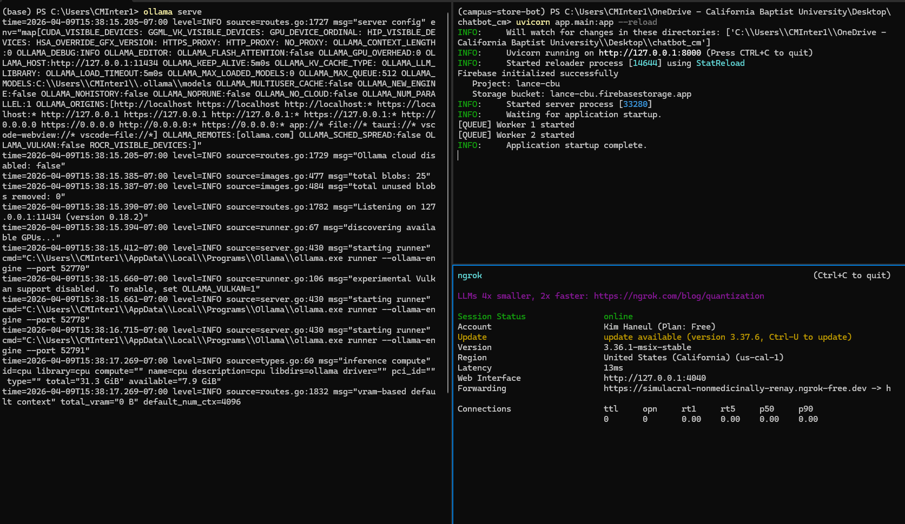
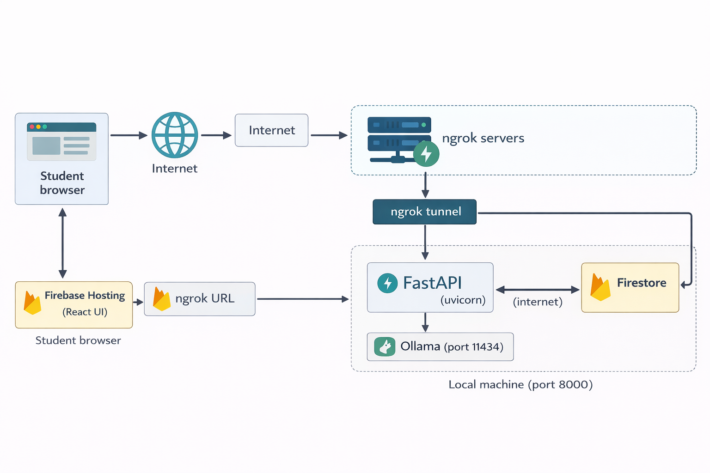

# Lance - IT Staff Handoff Guide

> **Who this document is for:** CBU IT staff responsible for keeping the Lance server running, managing the network configuration, and handling infrastructure-level issues. If you have not read `00_start_here.md` yet, read that first for a 10-minute overview of the whole system.

---

## 1. What IT is responsible for

IT is responsible for the infrastructure layer - keeping the machine running, the services alive, and the network accessible. Content management (adding new FAQ files, updating policies) is handled by Campus Store staff.

**IT responsibilities:**
- Keeping the local server machine running and accessible
- Managing the Ollama LLM service
- Managing the uvicorn FastAPI backend process
- Managing the ngrok tunnel (current) or reverse proxy (future)
- Configuring firewall rules and port access
- Managing the `.env` file and secrets
- Migrating from ngrok to a permanent CBU network solution
- Monitoring logs for errors

**Not IT responsibilities:**
- Adding or removing FAQ content files
- Updating textbook refund deadlines or seasonal content
- Managing the Firebase Hosting deployment (this is handled by the developer or Campus Store staff with Firebase CLI)
- Editing routing logic or Python code

---

## 2. System requirements

### Current machine
- **OS:** Windows 11
- **CPU:** AMD Ryzen 7 3800X
- **RAM:** 16GB DDR4
- **GPU:** NVIDIA GTX 1080 Ti (11GB VRAM)
- **Storage:** SSD (minimum 20GB free recommended)

### Recommended upgrade
The current machine is functional but slow for LLM inference (12-25 seconds per AI response). The recommended upgrade is a **Mac mini M4 Pro with 48GB unified memory** (~$1,400 retail, potentially less with CBU Apple education discount). This cuts LLM response time to 3-5 seconds and is the best price/performance option for Lance's workload.

See `research/lance_hardware_analysis.md` for the full hardware analysis and justification.

### Minimum requirements for any machine
- 16GB RAM (8GB absolute minimum, 16GB recommended)
- 20GB free disk space
- Python 3.11+
- macOS, Linux, or Windows 10/11
- Internet connection (for Firebase, ngrok, and initial Ollama model download)

---

## 3. Software dependencies

The following must be installed and running for Lance to work. Verify each one before starting.

### Python environment (conda)
```powershell
# Verify conda is installed
conda --version

# Verify the campus-store-bot environment exists
conda env list

# Activate the environment
conda activate campus-store-bot

# Verify key packages
pip show fastapi uvicorn sentence-transformers faiss-cpu firebase-admin
```

### Ollama
Ollama runs the local LLM (llama3.2). Download from: https://ollama.com

```powershell
# Verify Ollama is installed
ollama --version

# Verify the llama3.2 model is downloaded
ollama list

# If llama3.2 is not listed, download it
ollama pull llama3.2
```

### Node.js and npm
Required only if rebuilding or deploying the React frontend.
```powershell
node --version    # should be 18+
npm --version
```

### Firebase CLI
Required only for deploying frontend updates to Firebase Hosting.
```powershell
firebase --version

# If not installed
npm install -g firebase-tools
firebase login
```

### ngrok
Required for the current interim network setup.
```powershell
ngrok --version
```
Download from: https://ngrok.com if not installed. Requires a free account and auth token.

---

## 4. How to start the system from scratch

Follow these steps in order. Each service must be running before moving to the next.



### Step 1 - Start Ollama
Open a terminal and run:
```powershell
ollama serve
```
Leave this terminal open. You should see:
```
time=... level=INFO source=... msg="Listening on 127.0.0.1:11434"
```

### Step 2 - Activate the conda environment
Open a second terminal:
```powershell
conda activate campus-store-bot
cd C:\Users\[username]\Desktop\chatbot_cm
```

### Step 3 - Start the FastAPI backend
In the same terminal:
```powershell
uvicorn app.main:app --host 0.0.0.0 --port 8000
```
You should see:
```
Firebase initialized successfully
   Project: lance-cbu
INFO:     Application startup complete.
[QUEUE] Worker 1 started
[QUEUE] Worker 2 started
```

> **Note:** Use `--reload` flag only during development. In production, omit `--reload` for stability:
> ```powershell
> uvicorn app.main:app --host 0.0.0.0 --port 8000
> ```

### Step 4 - Start the ngrok tunnel
Open a third terminal:
```powershell
ngrok http 8000
```
You will see output like:
```
Forwarding   https://abc123.ngrok-free.app -> http://localhost:8000
```
**Copy the `https://` forwarding URL.** This is the public URL that the React frontend uses to reach the backend.

### Step 5 - Update the frontend API URL (if the ngrok URL changed)
If the ngrok URL is different from last time, update it in the frontend config:
```
ui/src/services/api.ts
```
Find the `API_BASE_URL` or equivalent constant and update it to the new ngrok URL. Then rebuild and redeploy:
```powershell
cd ui
npm run build
firebase deploy --only hosting
```

### Step 6 - Verify everything is working
Open a browser and go to the Firebase Hosting URL. Send a test message. You should get a response within 5-30 seconds depending on whether the LLM is needed.

---

## 5. How to restart individual services

### Ollama crashed or stopped responding
```powershell
# Stop any existing Ollama process (Windows)
taskkill /F /IM ollama.exe

# Restart
ollama serve
```

### uvicorn crashed or stopped
```powershell
# In the conda-activated terminal
conda activate campus-store-bot
cd C:\Users\[username]\Desktop\chatbot_cm
uvicorn app.main:app --host 0.0.0.0 --port 8000
```

### ngrok disconnected
ngrok free-tier tunnels disconnect after a period of inactivity or after 8 hours. When it disconnects:
1. Restart ngrok: `ngrok http 8000`
2. Check if the URL changed
3. If the URL changed, update `ui/src/services/api.ts` and redeploy the frontend

> **This is the most common operational issue.** The permanent fix is the CBU IT network migration - see Section 8.

### Port 8000 already in use
```powershell
# Find what is using port 8000
netstat -ano | findstr :8000

# Kill the process by PID
taskkill /F /PID [PID number]

# Then restart uvicorn
uvicorn app.main:app --host 0.0.0.0 --port 8000
```

---

## 6. How to verify Lance is healthy

Run through this checklist to confirm the full system is working end to end.

**Check 1 - Ollama is running:**
```powershell
curl http://localhost:11434/api/tags
```
Expected: JSON response listing available models including `llama3.2`.

**Check 2 - FastAPI backend is running:**
```powershell
curl http://localhost:8000/health
```
Expected: `{"status": "ok"}` or similar. If this fails, uvicorn is not running.

**Check 3 - ngrok tunnel is active:**
Open the ngrok dashboard at http://localhost:4040 in a browser. You should see active tunnel status and recent requests.

**Check 4 - End-to-end test:**
```powershell
$body = '{"message": "What are the Campus Store hours?", "session_id": "health-check-001"}'
Invoke-WebRequest -Uri "http://localhost:8000/chat" -Method POST -ContentType "application/json" -Body $body | Select-Object -ExpandProperty Content
```
Expected: A JSON response containing the store hours. Response time should be under 1 second for this query (it is a direct FAQ lookup, no LLM involved).

**Check 5 - FAISS indexes are valid:**
```powershell
conda activate campus-store-bot
cd C:\Users\[username]\Desktop\chatbot_cm
python scripts/validate_indexes.py
```
Expected: All lines show `PASS`. If any show `FAIL`, the content files or indexes may be missing or corrupted - run `python -m app.rag.ingest` to rebuild.

---

## 7. Current network setup - ngrok



Lance currently uses ngrok as an interim network solution. Here is how it works:

1. The React frontend is hosted on Firebase Hosting (Google's CDN) - this is permanent and does not need ngrok
2. The FastAPI backend runs on the local Campus Store machine on port 8000
3. ngrok creates a secure tunnel from a public HTTPS URL to port 8000 on the local machine
4. The React frontend is configured with the ngrok URL so it can reach the backend

**Limitations of ngrok:**
- Free-tier tunnels expire and generate a new URL each time ngrok restarts
- Every time the URL changes, the frontend config must be updated and redeployed
- Not suitable for permanent production use
- Dependent on ngrok's external servers being available

**Where the ngrok URL is configured:**
```
ui/src/services/api.ts
```
Look for the `API_BASE_URL` constant. This must match the current ngrok forwarding URL.

---

## 8. Future network migration plan

The ngrok tunnel should be replaced with a permanent CBU IT network solution. This section describes exactly what is needed.

**What CBU IT needs to provide:**
1. **Static IP address** assigned to the Campus Store machine
2. **DNS hostname** - e.g. `lance.calbaptist.edu` or `chatbot.campusstore.calbaptist.edu`
3. **Port 8000 accessible** from outside the CBU network (or a reverse proxy handling this)
4. **HTTPS/SSL certificate** - required for the React frontend to communicate with the backend (browsers block HTTP requests from HTTPS pages)

**What is already in the codebase:**
- `railway.toml` - deployment config that can be adapted for server deployment
- `Dockerfile` and `docker-compose.yml` - the backend is containerized and ready to deploy
- Firebase frontend is already on HTTPS

**Recommended reverse proxy setup (nginx):**
```nginx
server {
    listen 443 ssl;
    server_name lance.calbaptist.edu;

    ssl_certificate /path/to/cert.pem;
    ssl_certificate_key /path/to/key.pem;

    location / {
        proxy_pass http://localhost:8000;
        proxy_set_header Host $host;
        proxy_set_header X-Real-IP $remote_addr;
        proxy_read_timeout 120s;  # important - LLM responses can take 30s+
    }
}
```

**After migration, update the frontend:**
```
ui/src/services/api.ts
```
Replace the ngrok URL with the permanent HTTPS hostname. Rebuild and redeploy to Firebase:
```powershell
cd ui
npm run build
firebase deploy --only hosting
```

**Migration checklist:**
- [ ] CBU IT assigns static IP to Campus Store machine
- [ ] DNS record created pointing hostname to static IP
- [ ] SSL certificate obtained and installed
- [ ] nginx (or equivalent) installed and configured
- [ ] Port 443 open on Campus Store machine firewall
- [ ] Frontend API URL updated and redeployed
- [ ] ngrok removed from startup procedure
- [ ] End-to-end health check passes

---

## 9. Ports and firewall

| Port | Service | Direction | Notes |
|---|---|---|---|
| 8000 | FastAPI / uvicorn | Inbound | Main API port. Must be accessible to ngrok (or reverse proxy after migration) |
| 11434 | Ollama | Local only | LLM service. Should NOT be exposed to the internet |
| 5173 | React dev server | Local only | Development only - not used in production |
| 443 | nginx (future) | Inbound | HTTPS reverse proxy - needed after IT migration |
| 80 | nginx (future) | Inbound | HTTP redirect to HTTPS - needed after IT migration |

**Firewall rules needed for current setup (ngrok):**
- Port 8000 must be reachable from localhost (ngrok connects locally)
- No inbound firewall rules needed for ngrok - it connects outbound to ngrok servers

**Firewall rules needed after IT migration:**
- Port 443 open inbound from internet
- Port 80 open inbound (for HTTP -> HTTPS redirect)
- Port 8000 blocked from internet (only accessible via reverse proxy on same machine)
- Port 11434 blocked from internet (Ollama local only)

---

## 10. Environment variables and secrets

The `.env` file lives in the project root:
```
C:\Users\[username]\Desktop\chatbot_cm\.env
```

**Required variables:**

| Variable | Description | Example |
|---|---|---|
| `LANCE_ADMIN_USER` | Username for Admin UI login | `admin` |
| `LANCE_ADMIN_PASSWORD` | Password for Admin UI login | Same pwd as CMInter1 |
| `FIREBASE_STORAGE_BUCKET` | Firebase Storage bucket name | `lance-cbu.firebasestorage.app` |

**Optional overrides:**

| Variable | Default | Description |
|---|---|---|
| `FIREBASE_SERVICE_ACCOUNT_PATH` | `app/firebase-service-account.json` | Path to Firebase credentials |
| `MAX_CONCURRENT_LLM_REQUESTS` | `2` | How many simultaneous LLM requests are allowed |
| `MAX_CHUNK_TOKENS` | `400` | Maximum token size per FAISS chunk |

**Firebase service account key:**
Located at: `app/firebase-service-account.json`
This file grants access to Firebase Storage and Firestore. It must never be committed to git (it is in `.gitignore`). If the file is lost, generate a new one from the Firebase console:
1. Go to console.firebase.google.com
2. Select project `lance-cbu`
3. Project Settings -> Service Accounts -> Generate new private key

**Security rules:**
- Never commit `.env` or `firebase-service-account.json` to git
- Change `LANCE_ADMIN_PASSWORD` from the default before going live
- The Admin UI is accessible at `/admin` - ensure this is not publicly accessible without the password

---

## 11. Logs and monitoring

### Where to find logs
Logs print to the terminal where uvicorn is running. There is no log file by default. To save logs to a file:
```powershell
uvicorn app.main:app --host 0.0.0.0 --port 8000 2>&1 | Tee-Object -FilePath logs\lance.log
```

### What normal log output looks like
```
Firebase initialized successfully
   Project: lance-cbu
INFO:     Application startup complete.
[QUEUE] Worker 1 started
[QUEUE] Worker 2 started
INFO:     POST /chat HTTP/1.1 200 OK
[PERF] PERFORMANCE METRICS:
   Retrieval: 12.34ms
   LLM: 0.00ms (FAQ direct answer)
   Total: 14.56ms
```

### Signs of a healthy system
- `Application startup complete` appears on startup
- Chat requests show `200 OK`
- `[PERF]` lines show `Total:` under 100ms for FAQ answers
- No `ERROR` or `CRITICAL` lines

### Signs of a problem
| Log message | Meaning | Fix |
|---|---|---|
| `Firebase initialization failed` | Firebase credentials missing or invalid | Check `app/firebase-service-account.json` exists |
| `Connection refused` on port 11434 | Ollama is not running | Run `ollama serve` |
| `LLM: 25000ms` | LLM is very slow | Normal on current hardware - hardware upgrade will fix this |
| `[LLM FALLBACK] Low confidence - escalating` | Question had no good content match | Normal behavior - not an error |
| `FAIL` in validate_indexes output | FAISS index is missing or corrupted | Run `python -m app.rag.ingest` |

---

## 12. Common IT problems and fixes

**Problem: ngrok tunnel disconnected, students cannot reach Lance**
```powershell
# Restart ngrok
ngrok http 8000
# Check if URL changed - if so, update ui/src/services/api.ts and redeploy
cd ui && npm run build && firebase deploy --only hosting
```

**Problem: uvicorn failed to start - "Address already in use"**
```powershell
# Find and kill whatever is using port 8000
netstat -ano | findstr :8000
taskkill /F /PID [PID]
# Restart uvicorn
uvicorn app.main:app --host 0.0.0.0 --port 8000
```

**Problem: Ollama not responding**
```powershell
# Check if Ollama process exists
Get-Process ollama -ErrorAction SilentlyContinue
# Kill and restart
taskkill /F /IM ollama.exe
ollama serve
```

**Problem: LLM responses stopped working but FAQ answers still work**
The LLM fallback requires Ollama. FAQ answers do not. If FAQ answers work but LLM answers fail:
```powershell
# Test Ollama directly
curl http://localhost:11434/api/tags
# If no response, restart Ollama
ollama serve
```

**Problem: "Firebase initialization failed" on startup**
```powershell
# Check the service account file exists
Test-Path app/firebase-service-account.json
# Check the .env has the correct bucket name
Get-Content .env
```

**Problem: validate_indexes.py shows FAIL**
```powershell
conda activate campus-store-bot
python -m app.rag.ingest
python scripts/validate_indexes.py
# Should now show all PASS
```

**Problem: machine was restarted and nothing is running**
Follow Section 4 - How to start the system from scratch - in order:
1. `ollama serve`
2. `conda activate campus-store-bot` -> `uvicorn app.main:app --host 0.0.0.0 --port 8000`
3. `ngrok http 8000`
4. Check if ngrok URL changed and update frontend if needed

> **Tip:** Consider setting up Ollama and uvicorn as Windows startup services so they start automatically after a machine reboot. This reduces the manual restart burden significantly.
