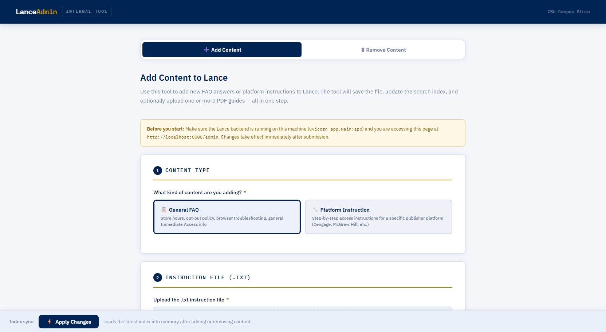
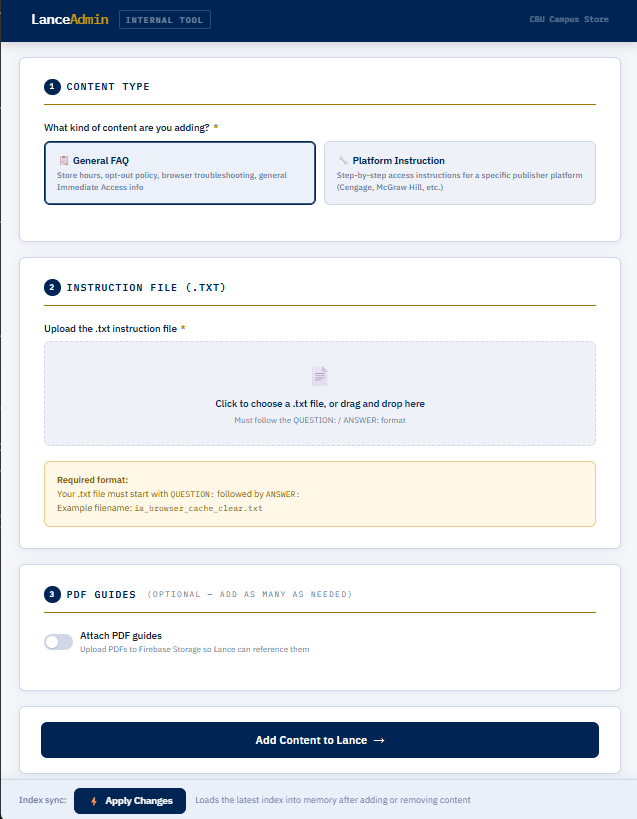
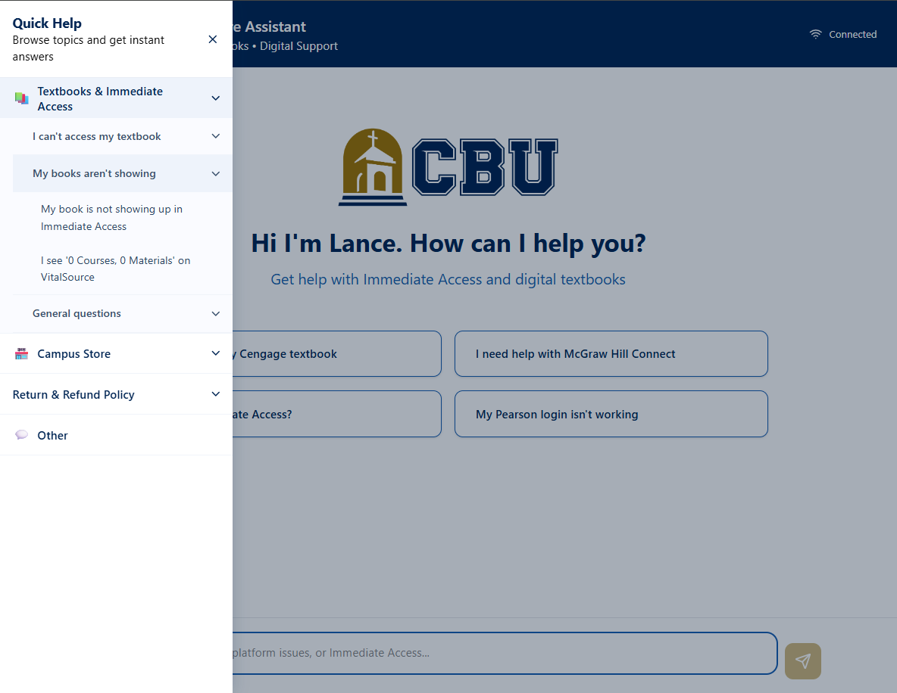

# Lance - Campus Store Staff Handoff Guide

> **Who this document is for:** CBU Campus Store staff responsible for maintaining Lance's content, updating seasonal information, and monitoring response quality. No coding experience is required to follow this guide. If you have not read `00_start_here.md` yet, read that first.

---

## 1. What Campus Store staff is responsible for

Your role is keeping Lance's answers accurate and up to date. The server infrastructure is IT's responsibility. Your responsibility is the content - what Lance knows and how it responds.

**Your responsibilities:**
- Adding new FAQ content when new student issues arise
- Updating existing content when policies, deadlines, or information changes
- Updating textbook refund deadlines and rental return dates at the start of each semester
- Keeping the FAQ sidebar options in sync with what Lance can answer
- Testing Lance's responses and identifying when answers are wrong
- Escalating technical problems to IT when needed

**Not your responsibility:**
- Keeping the server running (that is IT)
- Fixing routing logic or Python code (that requires a developer)
- Managing Firebase or Firestore directly (use the Admin UI instead)
- Editing `app/main.py` or any other Python file

---

## 2. How to access Lance

**Student-facing chat UI:**
The URL is your Firebase Hosting URL - it looks like `https://lance-cbu.web.app` or a custom domain if one has been configured. This is what students see.

**Admin UI:**
```
http://localhost:8000/admin
```
The Admin UI only works when the Lance backend is running on the local Campus Store machine. It is not accessible from outside the building unless the server is running and the network is configured. If you cannot reach it, check with IT that the server is running.

**Admin UI login:**
- Username and password are stored in the `.env` file on the server machine
- Default username: `admin`
- Ask IT for the password if you do not have it

---

## 3. The Admin UI - your main tool



The Admin UI is a web page that lets you manage Lance's content without touching any code or the terminal. You access it at `http://localhost:8000/admin` when the server is running.



**Add Content tab:**
Use this when you want Lance to know something new - a new policy, a new platform, updated store information, etc. You upload a `.txt` file and Lance immediately learns from it after the index is rebuilt.

**Remove Content tab:**
Use this when content is outdated or incorrect and you want to remove it entirely. Select the file from the dropdown and click Remove. Lance will stop using it immediately after the index is rebuilt.

**Apply Changes button (bottom of the page):**
After adding or removing content, click Apply Changes to hot-reload the FAISS index. This makes the changes live without restarting the server. If the hot-reload fails, the page will show instructions for a manual restart - contact IT if that happens.

**Debug Mode card (below the Remove Content tab):**
Lets you switch all new sessions into "LLM mode" for testing. See Section 8 for how to use this.

---

## 4. How to add a new FAQ answer

Use this process whenever a student asks something Lance cannot answer, or when you receive a new type of support email that Lance should be handling.

### Step 1 - Write the content file

Create a plain text file (`.txt`) on your computer using Notepad or any text editor. The file must follow this exact format:

```
QUESTION:
What is the question a student would ask?

ANSWER:
The answer Lance should give.

Include as much detail as needed. You can use multiple paragraphs.
Use dashes for bullet points:
- Point one
- Point two

Always end with contact information if relevant:
Email: ImmediateAccess@calbaptist.edu
Phone: 951-343-4259
```

**Naming convention:**
Name the file descriptively using underscores and no spaces:
- `campus_store_hours.txt` - for store information
- `ia_cengage_access.txt` - for Immediate Access platform issues (`ia_` prefix)
- `textbook_return_policy.txt` - for policy content

**Important rules for writing content:**
- Put the most important information at the top of the ANSWER section - Lance retrieves the beginning of the file most reliably
- Keep the file under about 400 words. If the content is longer, consider splitting it into two separate files by topic
- Be specific. "Contact ImmediateAccess@calbaptist.edu" is better than "contact the Campus Store"
- Write in plain language as if explaining to a student, not a colleague

### Step 2 - Upload through the Admin UI

1. Go to `http://localhost:8000/admin`
2. Click the **Add Content** tab
3. Select content type:
   - **FAQ** - for general questions, policies, store information
   - **Instruction** - for step-by-step platform access guides
4. Click **Choose File** and select your `.txt` file
5. Optionally attach a PDF guide if you have one (this will appear in the right sidebar when relevant)
6. Click **Upload**

### Step 3 - Apply Changes

Click the **Apply Changes** button at the bottom of the Admin UI page. Wait for the confirmation message.

### Step 4 - Test it

Go to the student-facing chat UI and type a question that should trigger your new content. Verify the response is correct. If it is not being retrieved, see Section 8 for how to diagnose the issue.

---

## 5. How to update existing content

When information changes - store hours, refund deadlines, policies, platform instructions - follow this process:

### Option A - Re-upload through the Admin UI (recommended)

1. Edit the existing `.txt` file on your computer with the updated information
2. Go to the Admin UI -> **Remove Content** tab
3. Find and remove the old version of the file
4. Click **Apply Changes**
5. Go to **Add Content** tab and upload the updated file
6. Click **Apply Changes** again
7. Test the updated answer in the chat UI

### Option B - Edit directly on the server

If you have access to the server machine:
1. Navigate to `data/faqs/` for FAQ files or `data/instructions/` for instruction files
2. Edit the `.txt` file directly
3. Open a terminal, activate the environment, and run:
   ```powershell
   conda activate campus-store-bot
   python -m app.rag.ingest
   ```
4. Test the updated answer

---

## 6. Seasonal maintenance checklist

At the start of every semester, the following files must be updated. If they are not updated, Lance will give students wrong deadline information.

| File | What to update | When |
|---|---|---|
| `textbook_refund_policy.txt` | Fall and Spring semester return deadlines (FAQ_3 and FAQ_4) | Before first day of classes |
| `campus_store_textbook_rentals.txt` | Rental return deadline date | Before first day of classes |
| `campus_store_hours.txt` | Store hours if they have changed | If hours change |

See `11_seasonal_maintenance.md` for the complete step-by-step checklist including exactly which lines to update in each file.

> **This is the single most important maintenance task.** Wrong deadline dates will cause real problems for students trying to return textbooks.

---

## 7. The FAQ sidebar - keeping it in sync



The FAQ sidebar is the menu students can open on the left side of the chat. It shows predefined topic categories and options that students can click to auto-send a question to Lance.

**When to update the sidebar:**
- You added a new FAQ that students commonly ask about -> add it to the sidebar so they can find it without typing
- You removed a content file -> remove the corresponding sidebar option so students do not select something Lance no longer answers
- Platform names or wording changed -> update the sidebar to match

**How to update the sidebar:**
The sidebar content is controlled by a single file:
```
ui/src/faqConfig.ts
```

This file is written in a straightforward format. Each category has a list of options, and each option is the exact text that gets sent to Lance when a student clicks it. You do not need to understand TypeScript to edit it - just follow the existing pattern.

After editing `faqConfig.ts`, the frontend needs to be rebuilt and redeployed:
```powershell
cd ui
npm run build
firebase deploy --only hosting
```
If you are not comfortable running these commands, ask IT or a developer to deploy after you make the edit.

---

## 8. How to test whether Lance is giving the right answer

### Basic testing - just ask it
Go to the student-facing chat UI and type the question a student would ask. Read the response and verify it is correct and complete.

### Using debug mode for comparison
The chat UI has a small pill in the top-right corner that shows either **"Auto mode"** or **"LLM mode"**. Clicking it toggles between the two modes for your current session only - students in other sessions are not affected.

- **Auto mode** - normal operation, uses pre-written content directly
- **LLM mode** - uses AI reasoning over the retrieved content

To diagnose a wrong answer:
1. Ask the question in Auto mode - note the response
2. Click the pill to switch to LLM mode
3. Ask the same question - note the response
4. Compare:

| Auto mode | LLM mode | Diagnosis |
|---|---|---|
| Wrong answer | Also wrong | **Content gap** - the relevant `.txt` file doesn't exist or doesn't cover this topic. Add or update the content file. |
| Wrong answer | Correct answer | **Routing issue** - the content exists but the routing logic is sending the query to the wrong file. This requires a developer fix. |
| Correct answer | Different answer | Auto mode is working correctly. LLM mode difference is expected behavior. |
| No answer / escalation | Correct answer | Content exists but FAISS is not retrieving it reliably. May need a routing fix or better content phrasing. |

### What to do when the answer is wrong

**If it is a content gap (most common):**
Write a new `.txt` file covering the missing topic and upload it through the Admin UI (see Section 4).

**If it is a routing issue:**
Document the question and the wrong response. Email it to the developer contact with a description of what the correct answer should be. Do not attempt to edit `app/main.py` yourself.

**If Lance is completely down:**
Contact IT. Lance being unreachable is an infrastructure problem, not a content problem.

---

## 9. How to escalate a technical problem

**Student cannot reach the chat UI at all:**
-> Contact IT. The server or ngrok tunnel may be down.

**Lance is responding but giving wrong answers consistently:**
-> Follow Section 8 to diagnose. If it is a content issue, fix it yourself. If it is a routing issue, escalate to a developer.

**Lance is responding very slowly (30+ seconds for every message):**
-> This is a hardware limitation on the current machine. Normal for LLM fallback responses. The hardware upgrade (Mac mini M4 Pro 48GB) will fix this. Not an emergency.

**A student reports they cannot access their textbook:**
If Lance directed the student incorrectly, collect:
- The exact question the student typed
- The response Lance gave
- What platform/publisher the student is using
- What error message the student saw

Then fix the content if it is a gap, or escalate to the developer if it is a routing issue. For the student's immediate problem, direct them to ImmediateAccess@calbaptist.edu.

**Admin UI is not accessible:**
-> Contact IT. The backend server is not running.

---

## 10. What NOT to change

The following should only be changed by a developer. Editing these incorrectly can break Lance entirely.

| File / Component | Why not to touch it |
|---|---|
| `app/main.py` | Contains all routing logic - 3700+ lines. Incorrect edits will cause Lance to stop working |
| `app/rag/ingest.py` | Controls how content is processed into the vector database |
| `app/rag/retriever.py` | Controls how Lance searches for relevant content |
| `app/rag/platforms.yaml` | Platform keyword definitions - editing incorrectly will break platform detection |
| `app/firebase_config.py` | Firebase connection setup |
| `app/firebase-service-account.json` | Firebase credentials - never share or commit to git |
| `.env` file | Server secrets - only IT should change these |
| `conda` environment | Do not install or uninstall Python packages |
| Any file in `ui/src/` except `faqConfig.ts` | React component code - requires developer knowledge |

**The safe zone for Campus Store staff:**
- `data/faqs/` - add, edit, or remove `.txt` FAQ files
- `data/instructions/` - add, edit, or remove `.txt` instruction files
- `ui/src/faqConfig.ts` - update FAQ sidebar options
- The Admin UI - add/remove content, test debug mode

If you are ever unsure whether a change is safe, do not make it. Contact the developer first.
