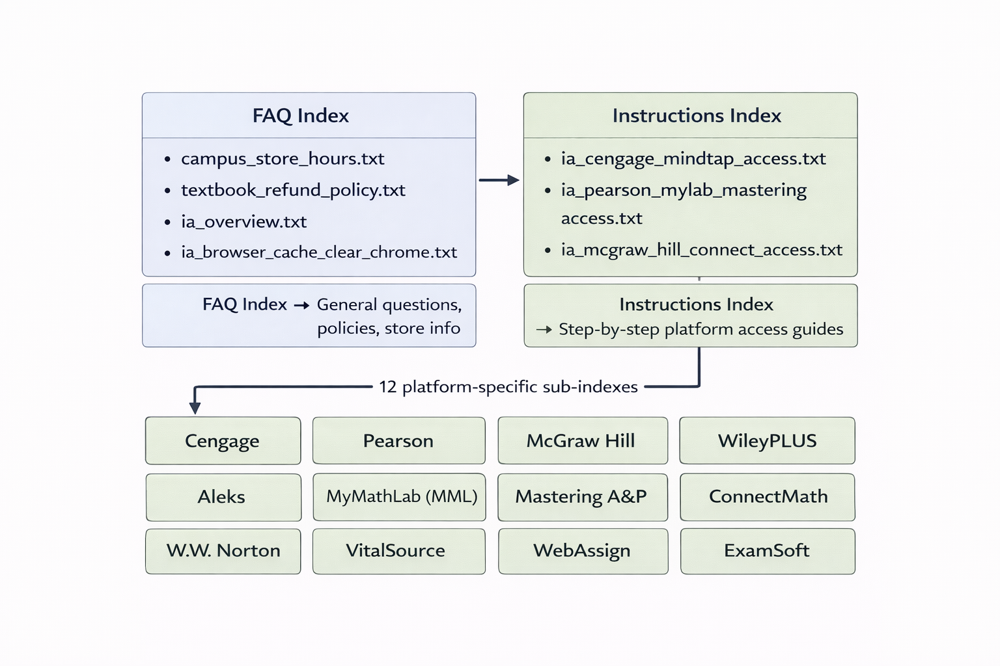
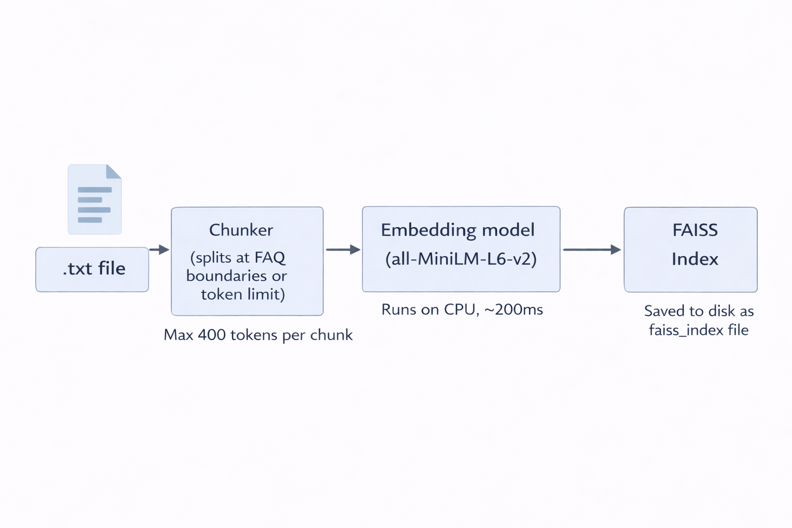

# Lance - RAG System Handoff Guide

> **Who this document is for:** Anyone who needs to understand how Lance finds and returns answers - developers, technically curious Campus Store staff, or IT staff who want a deeper understanding of the system. If you just need to add content, `02_campus_store_handoff.md` is sufficient. Read `00_start_here.md` first if you have not already.

---

## 1. What RAG means and why Lance uses it

**RAG** stands for **Retrieval-Augmented Generation**. It describes a pattern where a system retrieves relevant information first, then optionally uses an AI model to form a response based on that information - rather than relying on the AI's built-in knowledge alone.

For Lance, this means:
1. A student asks a question
2. Lance searches its library of pre-written content for the most relevant answer
3. If a strong match is found, Lance returns it directly - no AI generation needed
4. If no strong match is found, Lance passes the best available content to the LLM and asks it to reason over that content to form an answer
5. If no content is relevant at all, Lance escalates to the Campus Store team

**Why RAG instead of a pure AI chatbot:**

A pure AI chatbot (like asking ChatGPT directly) would generate answers from its training data - which knows nothing about CBU's specific Immediate Access setup, current semester deadlines, or platform-specific steps for CBU's Blackboard configuration. It would also hallucinate - confidently stating incorrect information.

Lance's RAG approach means every answer is grounded in content that Campus Store staff wrote and approved. The AI only ever reasons over that approved content. This also satisfies FERPA compliance requirements - no student data is sent to external AI APIs since everything runs locally.

---

## 2. The two indexes - FAQ vs Instructions

Lance maintains two separate content libraries, each stored as a FAISS vector index.



**FAQ Index (`data/faqs/faiss_index`):**
Contains general knowledge - store hours, return policies, what Immediate Access is, how to clear browser cache, opt-out policy. These are question-and-answer format files. Lance uses this index for any query that is not clearly about accessing a specific publisher platform.

**General Instructions Index (`data/instructions/faiss_index`):**
Contains step-by-step access guides for all platforms combined. Used when Lance needs to find the most relevant instruction chunk across all platforms.

**Platform-Specific Indexes (`data/instructions/faiss_index_cengage`, etc.):**
Each of the 12 supported platforms has its own dedicated FAISS index containing only that platform's instruction files. When Lance detects that a student is asking about a specific platform (e.g. "I can't access my Cengage textbook"), it searches the Cengage-specific index instead of the general one. This prevents cross-platform contamination - Pearson instructions will never appear in response to a Cengage question.

**Why keep them separate:**
If all content were in one index, a question about "how do I access my textbook" might return store hours or return policy content because those files also mention textbooks. Separating FAQ content from instruction content, and further separating instructions by platform, makes retrieval much more precise.

---

## 3. How ingestion works - from .txt file to searchable chunk

Ingestion is the process of taking a plain `.txt` content file and converting it into a format that FAISS can search. It runs every time you add or remove content.



**Step 1 - File reading:**
The ingestion script (`app/rag/ingest.py`) reads every `.txt` file in `data/faqs/` and `data/instructions/`.

**Step 2 - Chunking:**
Each file is split into chunks. FAQ files are split at `[FAQ_N]` markers if present, or at natural section boundaries. Instruction files are split at section headers. If a chunk exceeds 400 tokens (roughly 300 words), it is split into sub-chunks. This ensures no chunk is too large for the embedding model to process effectively.

**Step 3 - Embedding:**
Each chunk is passed through the embedding model - `all-MiniLM-L6-v2` from Sentence Transformers. This model converts the text into a vector of 384 numbers that represents the semantic meaning of the text. Similar meanings produce similar vectors. This runs on CPU and takes a fraction of a second per chunk.

**Step 4 - Metadata attachment:**
Each chunk is tagged with metadata: which file it came from, which platform it belongs to (for instruction files), and its position within the file. This metadata is stored alongside the vector and used to route responses correctly.

**Step 5 - FAISS index construction:**
All vectors are loaded into a FAISS `IndexFlatIP` (inner product / cosine similarity) index and saved to disk. The FAQ index and each platform instruction index are saved as separate files.

**The full ingestion pipeline runs in under 3 seconds** for the current corpus size. The output in the terminal shows each file processed and the total chunk count per index.

---

## 4. How retrieval works - from student question to best chunk

When a student sends a message, retrieval happens in milliseconds before any response is formed.

**Step 1 - Query embedding:**
The student's message is converted into a 384-dimension vector using the same embedding model used during ingestion. This is the query vector.

**Step 2 - Index selection:**
Lance determines which index to search based on the routing logic:
- If a platform was detected (e.g. "Cengage") -> search the platform-specific instruction index
- If no platform was detected but the query is about IA access -> search the general instructions index
- For general questions (store hours, policies, etc.) -> search the FAQ index

**Step 3 - Cosine similarity search:**
FAISS compares the query vector against every stored vector using inner product (cosine similarity). It returns the closest match - the chunk whose meaning is most similar to the student's question - along with a confidence score between 0.0 and 1.0.

**Step 4 - Confidence thresholding:**
The confidence score determines what happens next:

| Score range | Meaning | What Lance does |
|---|---|---|
| 0.60 and above | Strong match | Returns the answer directly from the chunk |
| 0.35 - 0.59 | Moderate match | Uses the chunk as grounding context for LLM fallback |
| 0.30 - 0.34 | Weak match | May attempt LLM fallback with caution |
| Below 0.30 | No useful match | Escalates to ImmediateAccess@calbaptist.edu |

**Step 5 - Answer extraction:**
If the confidence is high enough for a direct answer, Lance extracts the relevant portion of the chunk using a pattern matcher that finds the `ANSWER:` section or the most relevant paragraph.

**Retrieval is fast.** FAISS search on the current corpus (36 FAQ vectors + 33 instruction vectors) takes 10-25 milliseconds. The LLM fallback, when triggered, is what causes longer response times.

---

## 5. How the grounded LLM fallback uses retrieval

When no deterministic route matches a student's question, Lance uses the retrieved chunks to ground the LLM's response rather than letting the LLM answer from its own knowledge.

**The grounding process:**

1. `retrieve_grounding_context()` queries both the FAQ index and the platform-specific instruction index (if a platform is known)
2. Results are filtered by minimum confidence (0.35)
3. **Score gap filtering:** if the top chunk scores more than 0.15 higher than the second chunk, the weaker chunk is dropped. This prevents topic contamination - for example, dropping McGraw Hill login steps when the student asked about an expired IA charge
4. The remaining chunks are combined into a grounding context string
5. `build_grounded_prompt()` constructs a strict prompt:
   - "Answer only from the context provided"
   - "If the context does not contain enough information, say you don't know and provide the contact email"
   - "Do not make up steps, policies, or platform names not in the context"
6. The LLM receives this prompt and generates a response constrained to the provided context

**Why this matters:**
Without grounding, the LLM might invent plausible-sounding but incorrect steps for a platform it has seen in training data. With grounding, it can only say what the Campus Store's own approved content says. If the content does not cover the question, Lance says so and escalates - it does not guess.

---

## 6. Platform-specific indexes

Each of the 12 supported platforms has its own FAISS index stored in `data/instructions/`:

```
faiss_index_cengage
faiss_index_mcgraw
faiss_index_pearson
faiss_index_wiley
faiss_index_macmillan
faiss_index_sage
faiss_index_bedford
faiss_index_clifton
faiss_index_simucase
faiss_index_zybooks
faiss_index_inquizitive
faiss_index_stukent
```

**How the right index is selected:**
The routing logic in `app/main.py` calls `detect_platform_from_text()` on every incoming message. This function checks the message against a keyword list defined in `app/rag/platforms.yaml`. If "Cengage" or "MindTap" appears in the message, the platform is set to `cengage` and the `faiss_index_cengage` index is used for retrieval.

**Why platform-specific indexes exist:**
If all 12 platforms' instructions were in one index, a student asking about Pearson might get WileyPlus steps returned because both involve similar language ("log in," "create an account," "click Launch Courseware"). Platform-specific indexes guarantee that only Pearson content can answer Pearson questions.

**Contamination validation:**
The `scripts/validate_indexes.py` script checks that each platform index contains only chunks tagged with that platform's metadata. If a chunk from a different platform was accidentally ingested into the wrong index, the validation will catch it with a `FAIL` result.

---

## 7. How to run ingestion

Run this command from the project root any time you add, edit, or remove a `.txt` content file:

```powershell
conda activate campus-store-bot
python -m app.rag.ingest
```

**What the output means:**

```
=== Ingesting FAQs ===
Found 22 FAQ file(s) in data/faqs
  campus_store_hours.txt  ->  1 FAQ chunk(s)
  textbook_refund_policy.txt  ->  13 FAQ chunk(s)
  ...
  Saved index 'FAQs'  (36 vectors, dim=384)
=== FAQ ingestion complete: 36 total chunks ===

=== Ingesting Instructions ===
  ia_cengage_mindtap_access.txt  ->  1 section chunk(s)  [platforms: cengage]
  ...
  Saved index 'instructions_cengage'  (1 vectors, dim=384)
=== Instruction ingestion complete: 33 total chunks ===

Ingestion pipeline complete in 2.13 seconds.
```

**Normal numbers to expect:**
- FAQ chunks: ~36 vectors
- Instruction chunks: ~33 vectors (distributed across 12 platform indexes)
- Total time: under 5 seconds

**If a file shows `0 FAQ chunk(s)` or `0 section chunk(s)`:**
The file format may be incorrect. Check that it follows the `QUESTION:` / `ANSWER:` format for FAQ files, or has clear section headers for instruction files.

**If a file shows `Secondary split`:**
The file was too large and was automatically split into sub-chunks. This is normal for longer files. The content is still fully ingested.

**After ingestion, restart the server** to load the new indexes into memory:
```powershell
# Stop uvicorn (Ctrl+C) then restart
uvicorn app.main:app --host 0.0.0.0 --port 8000
```
Or use the **Apply Changes** button in the Admin UI to hot-reload without a full restart.

---

## 8. How to validate the indexes

After ingestion, always run the validation script to confirm everything is healthy:

```powershell
conda activate campus-store-bot
python scripts/validate_indexes.py
```

**What a healthy result looks like:**
```
--- Validating FAISS Indexes ---
PASS: FAQ index found and not empty
PASS: General Instructions index found and not empty
PASS: Cengage MindTap (Platform) index found and not empty
PASS: Cengage MindTap (Platform) chunks only contain platform 'cengage' metadata
...
PASS: Split browser cache file present in FAQ index metadata: ia_browser_cache_clear_chrome.txt
PASS: Legacy browser cache file absent
--- All FAISS indexes validated successfully! ---
```

**What each check means:**

| Check | What it verifies |
|---|---|
| Index found and not empty | The FAISS index file exists and has at least one vector |
| Chunks only contain platform metadata | No cross-platform contamination in platform-specific indexes |
| Split browser cache file present | The four browser-specific cache files are in the FAQ index |
| Legacy browser cache file absent | The old combined cache file was correctly removed |

**What to do when a check shows FAIL:**

| FAIL message | Likely cause | Fix |
|---|---|---|
| `FAQ index found and not empty` FAIL | No FAQ files exist or ingestion did not run | Check `data/faqs/` has `.txt` files, run ingestion |
| `chunks only contain platform 'X' metadata` FAIL | A file was placed in the wrong folder or has wrong platform keyword | Check the file's content and filename, re-run ingestion |
| `Split browser cache file missing` FAIL | One of the four browser cache files is absent from `data/faqs/` | Restore the missing file, re-run ingestion |
| `Legacy browser cache file absent` FAIL | The old `ia_browser_cache_clear.txt` still exists | Delete it from `data/faqs/`, re-run ingestion |

If validation passes after ingestion, the system is ready. If it fails, do not deploy the changes until the issue is resolved.
