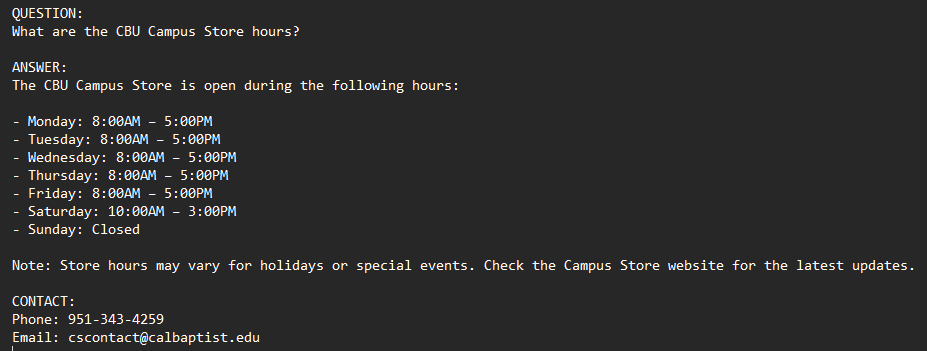
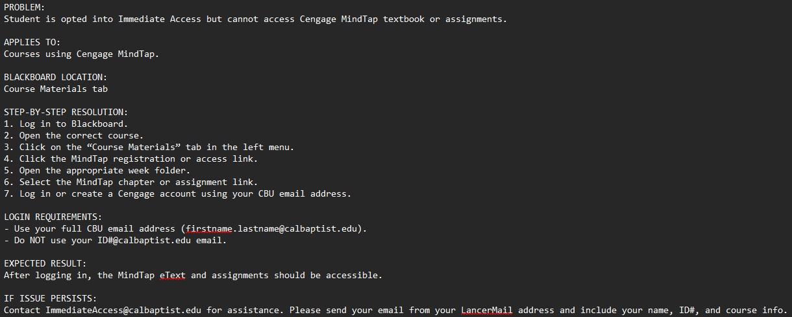

# Lance - Dataset Handoff Guide

> **Who this document is for:** Anyone who needs to understand, maintain, or add to Lance's content library - Campus Store staff, developers, or a successor inheriting the project. This document covers what content exists, how it is structured, and how to write new content that works well with the retrieval system. Read `03_rag_system.md` first if you want to understand how the content is used.

---

## 1. Overview - what the dataset is

Lance's dataset is a collection of plain `.txt` files stored in two directories:

```
data/faqs/           - General questions, policies, store information
data/instructions/   - Step-by-step platform access guides
```

These files are the single source of truth for everything Lance knows. When a student asks a question, Lance searches these files for the best match. If the answer is not in any of these files, Lance cannot answer the question - it will either attempt to reason over the closest content it has or escalate to the Campus Store team.

**There are no other knowledge sources.** Lance does not browse the internet, does not read from a database, and does not use the LLM's built-in training knowledge for student-facing answers. Everything comes from these `.txt` files.

This is intentional - it means Campus Store staff have complete control over what Lance says.

---

## 2. FAQ files - structure and format

FAQ files live in `data/faqs/` and cover general questions that are not specific to a single publisher platform.



### Single-entry FAQ format

The simplest FAQ file has one question and one answer:

```
QUESTION:
What are the CBU Campus Store hours?

ANSWER:
The CBU Campus Store is open during the following hours:

- Monday-Friday: 8:00AM - 5:00PM
- Saturday: 10:00AM - 3:00PM
- Sunday: Closed

Note: Store hours may vary for holidays or special events.

CONTACT:
Phone: 951-343-4259
Email: cscontact@calbaptist.edu
```

### Multi-entry FAQ format with `[FAQ_N]` markers

Some files contain multiple related questions. The `[FAQ_N]` markers tell the ingestion pipeline where each entry begins so they can be stored as separate searchable chunks:

```
[FAQ_0]
0. How do I return a textbook?
You can return textbook purchases either by shipping them back or in person...

[FAQ_1]
1. Can I return my textbooks by shipping them back?
Yes. You may return textbook purchases using a shipping method of your choice...

[FAQ_2]
2. Can I return textbooks in person at the CBU Campus Store?
Yes. Textbook purchases may be returned in person...
```

**When to use multi-entry format:**
Use `[FAQ_N]` markers when a topic has several related but distinct questions - like the textbook refund policy which has separate entries for shipping returns, in-person returns, Fall semester deadlines, Spring semester deadlines, and so on. Each `[FAQ_N]` entry becomes its own searchable chunk in the FAISS index.

**When to use single-entry format:**
Use a single `QUESTION:` / `ANSWER:` block when the topic is self-contained and a student would only ask one way - like store hours or the in-store pickup policy.

### What makes a good FAQ file

**Do:**
- Put the most important information at the very top of the `ANSWER:` section - FAISS may retrieve only the beginning of a long chunk
- Be specific to CBU - "contact ImmediateAccess@calbaptist.edu" not "contact your institution"
- Include the escalation contact at the end of every file
- Keep the total file under 400 words if possible - longer files get split into sub-chunks which may reduce retrieval accuracy
- Write in plain language as if explaining to a first-year student

**Do not:**
- Write vague answers like "please contact the store for more information" - if Lance escalates, it already says that
- Include information that changes every semester in the main body without a clear label - make it easy to find and update
- Duplicate content that already exists in another file - this can cause FAISS to return the wrong file

---

## 3. Instruction files - structure and format

Instruction files live in `data/instructions/` and contain step-by-step guides for accessing specific publisher platforms through Immediate Access.



### Instruction file format

All instruction files follow this standard structure:

```
PROBLEM:
[One sentence describing what the student is experiencing]

APPLIES TO:
[Which courses or platform this applies to]

BLACKBOARD LOCATION:
[Which tab or menu in Blackboard the student needs to navigate to]

STEP-BY-STEP RESOLUTION:
1. [First step]
2. [Second step]
3. [Continue...]

LOGIN REQUIREMENTS:
- [Any login-specific rules, e.g. use CBU email not ID number email]

EXPECTED RESULT:
[What the student should see after completing the steps]

IF ISSUE PERSISTS:
Contact ImmediateAccess@calbaptist.edu for assistance. Please send your
email from your LancerMail address and include your name, ID#, and course info.
```

### Why this structure matters

The consistent structure means FAISS can find instruction files reliably when a student describes a symptom. "I can't access my Cengage textbook" matches the `PROBLEM:` section. "Where do I find it in Blackboard?" matches the `BLACKBOARD LOCATION:` section. Each section serves a distinct retrieval purpose.

The `IF ISSUE PERSISTS:` section at the end of every instruction file ensures students always have a path forward even if the steps do not resolve their issue.

---

## 4. Complete content inventory

### FAQ files (`data/faqs/`)

| File | What it covers |
|---|---|
| `ia_overview.txt` | What Immediate Access is, how it works, billing |
| `ia_access_issue.txt` | IA shows opt-out option but textbook is not accessible |
| `ia_opt_out_physical_textbooks.txt` | Whether print textbooks are available after opting out |
| `ia_bundle_missing_textbook.txt` | Textbook missing from IA bundle - steps to investigate |
| `ia_browser_cache_clear_chrome.txt` | Clear cache in Chrome (desktop) - fixes "0 Courses 0 Materials" |
| `ia_browser_cache_clear_chrome_ipad.txt` | Clear cache in Chrome on iPad |
| `ia_browser_cache_clear_firefox.txt` | Clear cache in Firefox |
| `ia_browser_cache_clear_safari.txt` | Clear cache in Safari |
| `textbook_refund_policy.txt` | Full textbook return policy with semester deadlines seasonal |
| `campus_store_hours.txt` | Store hours update if hours change |
| `campus_store_location.txt` | Address and location |
| `campus_store_delivery_directions.txt` | Mailing address for returns |
| `campus_store_merchandise.txt` | What the store sells, product categories |
| `campus_store_ordering.txt` | How to place an order, processing time |
| `campus_store_shipping_policy.txt` | Flat rate shipping, delivery times |
| `campus_store_instore_pickup.txt` | 14-day pickup window, extension policy |
| `campus_store_digital_codes.txt` | Digital code licensing terms, access code policy |
| `campus_store_textbook_purchasing_terms.txt` | HEOA compliance, pricing terms |
| `campus_store_refund_merchandise.txt` | Merchandise return policy (30/60 day windows) |
| `campus_store_refund_technology.txt` | Technology and Apple return policy (5 day window) |
| `campus_store_refund_process.txt` | General return process - how to actually return something |
| `campus_store_textbook_rentals.txt` | Rental agreement, return deadlines seasonal |

### Instruction files (`data/instructions/`)

| File | Platform | What it covers |
|---|---|---|
| `ia_cengage_mindtap_access.txt` | Cengage | Accessing Cengage MindTap through Blackboard Course Materials tab |
| `ia_mcgraw_hill_connect_access.txt` | McGraw Hill | Accessing McGraw Hill Connect through Learning Activities tab |
| `ia_mcgraw_hill_connect_learning_activities_access.txt` | McGraw Hill | McGraw Hill via Learning Activities tab (alternate path) |
| `ia_mcgraw_hill_connect_tools_access.txt` | McGraw Hill | McGraw Hill via Tools tab |
| `ia_mcgraw_hill_tools_access.txt` | McGraw Hill | McGraw Hill Tools access |
| `ia_mcgraw_hill_connect_no_read_now.txt` | McGraw Hill | Explains "Launch Courseware" vs "Read Now" for McGraw Hill |
| `ia_pearson_mylab_mastering_access.txt` | Pearson | Accessing Pearson MyLab and Mastering through Blackboard |
| `ia_wileyplus_access.txt` | Wiley | Accessing WileyPlus through Blackboard |
| `ia_macmillan_achieve_access.txt` | Macmillan | Accessing Macmillan Achieve through Blackboard |
| `ia_sage_vantage_access.txt` | Sage | Accessing Sage Vantage through Weekly Chapters tab |
| `ia_bedford_bookshelf_access.txt` | Bedford | Accessing Bedford / VitalSource Bookshelf |
| `ia_bedford_bookshelf_email_error_access.txt` | Bedford | Bedford email error during account creation |
| `ia_vitalsource_bookshelf_account_creation.txt` | Bedford | VitalSource account creation steps |
| `ia_etextbook_general_access.txt` | Bedford | General eTextbook access via VitalSource |
| `ia_cliftonstrengths_assessment_access.txt` | CliftonStrengths | Accessing the CliftonStrengths assessment |
| `ia_simucase_access.txt` | SimuCase | Accessing SimuCase through Blackboard |
| `ia_zybooks_access.txt` | ZyBooks | Accessing ZyBooks through Blackboard |
| `ia_inquizitive_access.txt` | InQuizitive | Accessing InQuizitive / Norton through Blackboard |
| `ia_stukent_access.txt` | Stukent | Accessing Stukent through Blackboard |
| `ia_read_now_button_missing.txt` | General | What to do when "Read Now" button is missing |
| `ia_browser_chrome_cookies_popups.txt` | General | Enable cookies and popups in Chrome |
| `ia_browser_safari_cookies_popups.txt` | General | Enable cookies and popups in Safari |
| `ia_browser_ipad_safari_cookies_popups.txt` | General | Enable cookies and popups in Safari on iPad |
| `dc_codes_instore_redemption.txt` | General | How to redeem digital codes purchased in store |

---

## 5. Platform-specific content details

This section documents what Lance knows about each platform and important platform-specific notes.

### Cengage MindTap
- **Blackboard location:** Course Materials tab (left side menu)
- **Access path:** Course Materials -> MindTap registration link -> week folder -> chapter/assignment link
- **Login:** Must use full CBU email (`firstname.lastname@calbaptist.edu`) - not ID number email
- **Note:** Students create a Cengage account on first access

### McGraw Hill Connect
- **Blackboard location:** Learning Activities tab (primary) or Tools tab (alternate)
- **Access path:** Learning Activities -> week folder -> McGraw Hill Connect link
- **Login:** Must use full CBU email - not ID number email
- **Important:** McGraw Hill does NOT have a "Read Now" button. Students see "Launch Courseware" instead. This is correct and expected. Many students report this as a problem - Lance has a dedicated file (`ia_mcgraw_hill_connect_no_read_now.txt`) to explain this.

### Pearson MyLab / Mastering
- **Blackboard location:** Immediate Access tab
- **Access path:** Immediate Access tab -> Launch Courseware -> Continue (legal policies) -> Open MyLab & Mastering
- **Login:** Must use full CBU email - NOT the ID number email (`123456@calbaptist.edu`)
- **Note:** Students register for a Pearson account on first access. After registration they see a "You're done!" confirmation page.

### WileyPlus
- **Blackboard location:** Immediate Access tab
- **Access path:** Immediate Access tab -> WileyPlus link
- **Login:** CBU email required

### Bedford / VitalSource Bookshelf
- **Blackboard location:** Immediate Access tab
- **Access path:** Immediate Access tab -> Read Now button
- **Note:** Bedford content is delivered through VitalSource Bookshelf. Students may need to create a VitalSource account. Account creation issues (email error) have a dedicated file.
- **"0 Courses 0 Materials" issue:** This VitalSource error screen is caused by stale browser cache. Clearing cache and cookies resolves it in most cases. Four browser-specific files cover Chrome, Chrome on iPad, Firefox, and Safari.

### Sage Vantage
- **Blackboard location:** Weekly Chapters tab (not the Immediate Access tab)
- **Access path:** Weekly Chapters -> chapter link -> register as student
- **Important:** Sage Vantage is accessed through the Weekly Chapters tab, not the Immediate Access tab. Students who look only in the Immediate Access tab will not find it.
- **Common courses:** BEH 290 Introduction to Research Methods

### Macmillan Achieve
- **Blackboard location:** Immediate Access tab or course-specific link
- **Login:** CBU email required

### ZyBooks
- **Blackboard location:** Immediate Access tab or course link
- **Login:** CBU email required

### InQuizitive / Norton
- **Blackboard location:** Course content area
- **Login:** CBU email required

### SimuCase
- **Blackboard location:** Course content area
- **Note:** Used in specific health sciences courses

### CliftonStrengths
- **Blackboard location:** Course content area
- **Note:** Assessment tool, not a textbook platform

### Stukent
- **Blackboard location:** Course content area
- **Login:** CBU email required

---

## 6. Content authoring guide - how to write good content

Follow these rules when writing new `.txt` files to ensure Lance retrieves and presents them correctly.

### Naming conventions

| Content type | Naming pattern | Example |
|---|---|---|
| IA platform instruction | `ia_{platform}_{issue}.txt` | `ia_cengage_mindtap_access.txt` |
| Browser fix | `ia_browser_{browser}_{issue}.txt` | `ia_browser_cache_clear_chrome.txt` |
| Campus Store info | `campus_store_{topic}.txt` | `campus_store_hours.txt` |
| General IA FAQ | `ia_{topic}.txt` | `ia_overview.txt` |
| Refund/return policy | `campus_store_refund_{category}.txt` | `campus_store_refund_technology.txt` |

Use lowercase letters and underscores only. No spaces, no capital letters, no special characters.

### Writing rules

**Rule 1 - First sentence wins.**
FAISS retrieves the beginning of a chunk most reliably. Put the most important information in the first 1-2 sentences of the `ANSWER:` section. Do not save the key point for the end.

**Rule 2 - Stay under 400 words per file.**
Files longer than 400 tokens get split into sub-chunks during ingestion. If a file must be long, use `[FAQ_N]` markers so the splits happen at logical boundaries rather than mid-sentence.

**Rule 3 - Be CBU-specific.**
Do not write generic instructions. Write what a CBU student needs to do in CBU's Blackboard configuration. "Click the Immediate Access tab in Blackboard" is better than "navigate to your course materials."

**Rule 4 - Always end with escalation.**
Every file should end with:
```
IF ISSUE PERSISTS:
Contact ImmediateAccess@calbaptist.edu for assistance. Please send your
email from your LancerMail address and include your name, ID#, and course info.
```
Or for general Campus Store content:
```
CONTACT:
Email: cscontact@calbaptist.edu
Phone: 951-343-4259
```

**Rule 5 - One topic per file.**
Do not combine multiple unrelated topics in one file. A file about Cengage access should only cover Cengage access - not Cengage plus browser cache issues plus general IA questions. When topics are combined, FAISS may return the wrong file for a specific question.

**Rule 6 - Test after adding.**
After uploading a new file and re-ingesting, go to the chat UI and ask the question the file is meant to answer. Verify the response uses your new content. If it does not, the file phrasing may need adjustment or an enhanced retrieval query may need to be added in `app/main.py` (requires developer).

---

## 7. Content that needs seasonal updates

The following files contain date-sensitive information. They must be reviewed and updated at the start of every Fall and Spring semester.

### `textbook_refund_policy.txt`

Update `[FAQ_3]` and `[FAQ_4]` with the new semester return deadlines:

```
[FAQ_3]
3. What is the return policy for Fall 20XX semester textbooks?
- Returns and exchanges accepted without penalty until [DATE]
- Returns accepted with 25% restocking fee from [DATE] through [DATE]
- All sales are FINAL after [DATE]

[FAQ_4]
4. What is the return policy for Spring 20XX semester textbooks?
- Returns and exchanges accepted without penalty until [DATE]
- Returns accepted with 25% restocking fee from [DATE] through [DATE]
- All sales are FINAL after [DATE]
```

Also update `[FAQ_0]` (the "How do I return a textbook?" summary) which lists the current semester deadlines.

### `campus_store_textbook_rentals.txt`

Update the rental return deadline at the bottom of the file:

```
CURRENT RENTAL RETURN DEADLINE:
[Season] 20XX rental books must be returned to the Campus Store by
[DATE] to avoid being charged the Replacement Cost Fee.
```

### `campus_store_hours.txt`

Update if store hours change between semesters or for holidays.

See `11_seasonal_maintenance.md` for the complete step-by-step checklist.

---

## 8. Content gaps - known limitations

The following topics are not currently well-covered by Lance's content. These represent areas where students may get incomplete or escalated responses.

| Topic | Current state | Recommended fix |
|---|---|---|
| Opted out by accident - can I opt back in? | Routes to IA refund policy (partially relevant) | Add dedicated `ia_opt_back_in.txt` FAQ file |
| I was charged for Immediate Access unexpectedly | Routes to IA refund/enrollment queries | Add `ia_unexpected_charge.txt` FAQ file |
| My access expired mid-semester | LLM fallback with refund policy grounding | Add `ia_access_expired.txt` FAQ file with specific guidance |
| I need to access my textbook on multiple devices | Routes to platform clarification | Add platform-specific multi-device guidance to each instruction file |
| Financial aid delay affecting IA access | Not covered - escalates | Add `ia_financial_aid_delay.txt` FAQ file |
| Canvas / Moodle questions | Correctly out-of-scope - escalates to CBU IT | No fix needed - correct behavior |
| Blackboard login issues | Correctly out-of-scope - escalates to CBU IT | No fix needed - correct behavior |
| New platform added by a professor mid-semester | No content for that platform - publisher list shown | Add instruction file for new platform |

When a new type of student question consistently results in escalation and the answer is known, that is a signal to add a new content file. Track these patterns using the email issue log at `research/email_issue_log.md`.
