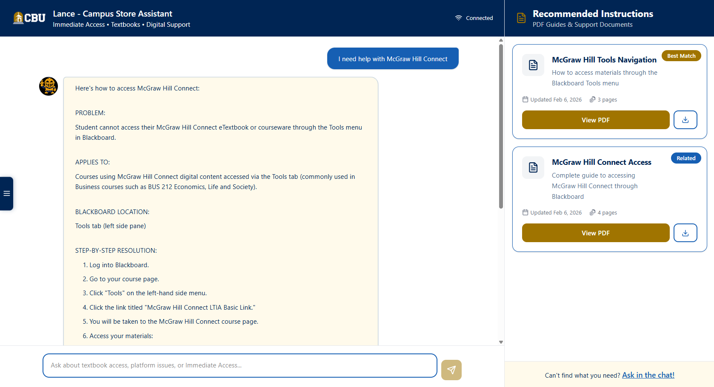
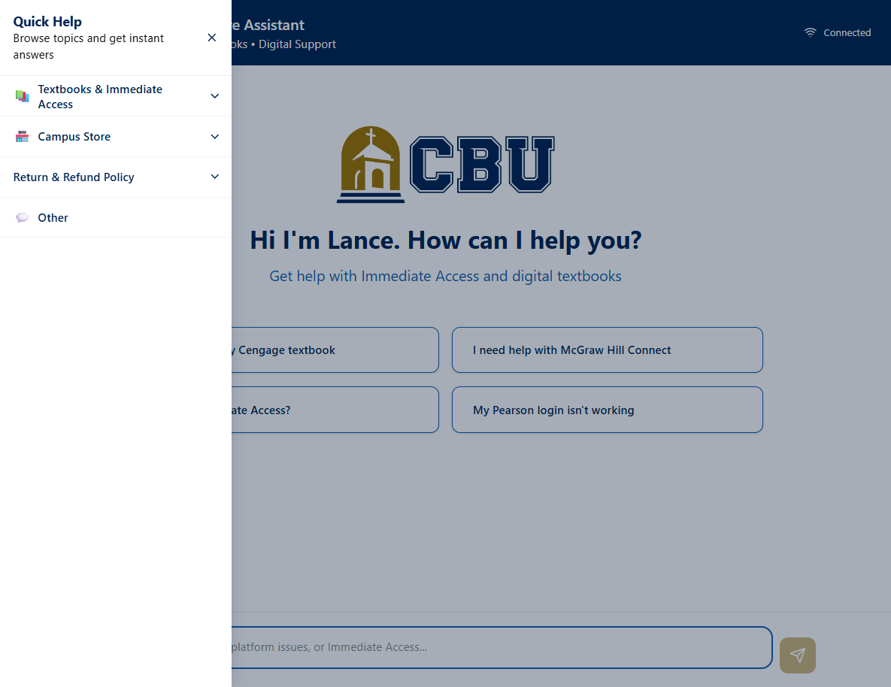

# Lance - UI Handoff Guide

> **Who this document is for:** Campus Store staff who maintain the FAQ sidebar, and developers who need to make frontend changes. The UI is intentionally stable - most of it does not need regular attention. The one file Campus Store staff will regularly touch is `ui/src/faqConfig.ts`. Everything else in the UI requires a developer. Read `00_start_here.md` first if you have not already.

---

## 1. Overview - what the UI is and who maintains it

The Lance chat UI is a React application hosted on Firebase Hosting. Students access it through a web browser - it is the page they see when they interact with Lance.

**Technology:**
- Built with React and TypeScript
- Styled with Tailwind CSS
- Hosted on Firebase Hosting (Google's CDN)
- Communicates with the FastAPI backend via HTTP

**Who maintains what:**

| Task | Who |
|---|---|
| Update FAQ sidebar options | Campus Store staff - edit `faqConfig.ts` |
| Update welcome screen quick-reply buttons | Developer |
| Fix UI bugs or add new components | Developer |
| Deploy frontend changes to Firebase | Developer or staff with Firebase CLI |
| Change colors, layout, or styling | Developer |

The UI was designed so that the most common maintenance task - keeping the FAQ sidebar in sync with Lance's capabilities - requires editing only one plain text-like file without touching any component code.

---

## 2. What the student sees - UI tour



**Welcome screen:**
When a student first opens Lance, they see the CBU logo, a greeting, and four quick-reply buttons covering the most common questions. These buttons auto-send a message to Lance when clicked.

**Chat area:**
Student messages appear on the right in blue bubbles. Lance's responses appear on the left with the Lance avatar, in a cream-colored bubble. URLs and email addresses in responses are automatically rendered as clickable gold links. If a response was generated by the LLM fallback (in debug mode), a small "LLM" badge appears above the response.

**FAQ sidebar (left):**
A collapsible panel that opens when the student clicks the toggle button on the left edge of the screen. Contains predefined topic categories and options. Clicking an option auto-sends that message to Lance. The sidebar is hidden by default and does not affect the chat area when closed.

**PDF recommendations sidebar (right):**
Shows relevant PDF guides when Lance returns a response that has associated PDFs stored in Firebase Storage. This panel is always visible on desktop but does not appear if there are no relevant PDFs for the current conversation.

**Debug mode toggle (top right):**
A small pill that shows "Auto mode" or "LLM mode." Staff use this to compare response quality between the two paths. Students do not need to interact with it - it defaults to Auto mode for every new session.

---

## 3. CBU color palette and design system

Anyone making changes to the UI must use these exact color values to maintain CBU brand consistency.

| Color | Hex value | Used for |
|---|---|---|
| CBU Navy | `#002554` | Header background, sidebar border, category headers, toggle button |
| CBU Gold | `#A07400` | Clickable links, debug mode pill border, LLM badge, hover accents |
| User message bubble | `#165FB3` | Student message background |
| Lance message bubble | `#FFFAEB` | Lance response background |
| Lance bubble border | `#165FB3` at 30% opacity | Lance message border |
| Sidebar option hover | `#EBF0F9` | Background on FAQ sidebar option hover |
| Out-of-scope background | `#5ACBF2` at 20% opacity | System messages |

**Typography:**
- Font family: Aptos / Calibri / system sans-serif (inherits from host)
- Bold text in responses is rendered using `**text**` markdown syntax, parsed in `ChatMessage.tsx`

**Border radius:**
- Message bubbles: `rounded-2xl` with one flat corner (`rounded-tr-sm` for user, `rounded-tl-sm` for Lance)
- Sidebar cards: `rounded-2xl`
- Input bar: `rounded-full`

---

## 4. Key component files

All frontend source files are in `ui/src/`. Here is what each file does - enough to know where to look when something needs changing.

### `App.tsx`
The main application file. Manages session ID, message history, debug mode state, API calls to the FastAPI backend, and renders all child components. If something about the overall chat flow needs changing, it starts here.

### `ChatMessage.tsx`
Controls how each message bubble is rendered. Parses `**bold**` markdown, applies `linkify()` to convert URLs and emails to clickable links, shows the LLM badge when `debug_mode` is true on a response, and handles the three message types (user, assistant, system).

### `FAQSidebar.tsx`
The left sidebar component. Reads its content from `faqConfig.ts`. Handles accordion open/close state, auto-send behavior on option click, overlay backdrop, Escape key to close, and mobile/desktop responsive behavior. **Do not edit this file to change sidebar content** - edit `faqConfig.ts` instead.

### `faqConfig.ts`
**The file Campus Store staff edit.** Contains all FAQ sidebar categories, subcategories, and options as a structured data object. See Section 5 for how to edit it.

### `ChatInput.tsx`
The message input bar at the bottom of the screen. Handles text input, send button, and keyboard shortcut (Enter to send).

### `PDFSidebar.tsx`
The right sidebar that shows PDF guide recommendations. Reads recommended PDFs from the API response and renders download/view links for each one.

### `WelcomeState.tsx`
The welcome screen shown before any messages are sent. Contains the CBU logo, greeting text, and four quick-reply buttons. See Section 6 to update the quick-reply buttons.

### `utils/linkify.tsx`
A utility function that scans plain text for URLs (`https://...`) and email addresses and converts them to clickable `<a>` tags styled in CBU gold. Applied automatically to all Lance response text in `ChatMessage.tsx`.

### `services/api.ts`
The API service layer. Contains the base URL for the backend and the functions that call `/chat`, `/session/debug-mode`, and other endpoints. If the backend URL changes (for example, after the IT network migration), update `API_BASE_URL` in this file.

---

## 5. How to update the FAQ sidebar

The FAQ sidebar content is entirely controlled by `ui/src/faqConfig.ts`. You do not need to understand TypeScript to edit it - just follow the existing pattern.



### Structure of faqConfig.ts

The file contains a list of categories. Each category has a name, icon, and either a list of options or a list of subcategories (which themselves have options):

```typescript
{
  category: "Campus Store",       // Category name shown in sidebar
  icon: "🏪",                     // Emoji shown next to category name
  options: [                      // Direct list of options (no subcategories)
    "What are the Campus Store hours?",
    "Where is the Campus Store located?",
    "What does the Campus Store sell?"
  ]
}
```

A category with subcategories looks like this:

```typescript
{
  category: "Textbooks & Immediate Access",
  icon: "📚",
  subcategories: [                // List of subcategories instead of options
    {
      label: "I can't access my textbook",    // Subcategory header
      options: [
        "I can't access my Cengage / MindTap textbook",
        "I can't access my McGraw Hill Connect textbook",
        "I can't access my Pearson MyLab / Mastering textbook",
        // ... more options
      ]
    },
    {
      label: "My books aren't showing",
      options: [
        "My book is not showing up in Immediate Access",
        "I see '0 Courses, 0 Materials' on VitalSource"
      ]
    }
  ]
}
```

### How to add a new option to an existing category

Find the category and the options list it belongs to. Add a new string to the array:

```typescript
options: [
  "What are the Campus Store hours?",
  "Where is the Campus Store located?",
  "What does the Campus Store sell?",
  "How do I place an order?"       // <- add new option here
]
```

The option text is exactly what gets sent to Lance when a student clicks it. Make sure it is phrased as a question Lance can answer - test it in the chat UI first.

### How to add a new category

Copy an existing category block and modify it. Add it to the array before the "Other" category (which should always be last):

```typescript
{
  category: "New Category Name",
  icon: "📋",
  options: [
    "First option text",
    "Second option text"
  ]
},
{
  category: "Other",    // Other always stays last
  icon: "💬",
  options: []
}
```

### How to remove an option

Delete the line containing the option text from the options array. Make sure to remove the trailing comma from the line above if the deleted option was the last one.

### After editing faqConfig.ts - build and deploy

```powershell
cd ui
npm run build
firebase deploy --only hosting
```

The change will be live for all students immediately after deployment.

---

## 6. How to update the welcome screen quick-reply buttons

The four quick-reply buttons on the welcome screen are defined in `ui/src/components/WelcomeState.tsx`. Look for an array of button objects that contain the button label text. Edit the text values to change what the buttons say and what message they send.

This requires a developer to deploy after editing - follow the same build and deploy steps as Section 5.

**Current default buttons:**
- "I can't access my Cengage textbook"
- "I need help with McGraw Hill Connect"
- "What is Immediate Access?"
- "My Pearson login isn't working"

These were chosen because they represent the most common student queries. Update them if usage patterns change over time.

---

## 7. How to build and deploy the frontend

Any time a frontend file is changed (`faqConfig.ts`, `WelcomeState.tsx`, or any component), the frontend must be rebuilt and redeployed to Firebase Hosting for students to see the change.

```powershell
# Navigate to the ui directory
cd ui

# Install dependencies (only needed first time or after npm package changes)
npm install

# Build the production bundle
npm run build

# Deploy to Firebase Hosting
firebase deploy --only hosting
```

**What each command does:**
- `npm run build` - compiles the TypeScript/React code into optimized static files in `ui/dist/`
- `firebase deploy --only hosting` - uploads the built files to Firebase Hosting and makes them live

**What to check after deployment:**
1. Open the Firebase Hosting URL in a browser
2. Hard refresh (Ctrl+Shift+R / Cmd+Shift+R) to bypass browser cache
3. Verify the change is visible
4. Send a test message to confirm the backend connection still works

**Common deployment issue - Firebase not logged in:**
```powershell
firebase login
# Follow the browser authentication flow
firebase deploy --only hosting
```

---

## 8. What requires a developer

The following changes require a developer and should not be attempted by Campus Store staff:

| Change | Why it requires a developer |
|---|---|
| Adding new UI components | Requires TypeScript and React knowledge |
| Changing how messages are rendered | Risk of breaking bold text parsing or linkify |
| Modifying `services/api.ts` | Could break communication with the backend |
| Changing the debug mode toggle behavior | Tied to backend session state management |
| Updating `ChatInput.tsx` | Could break message sending |
| Modifying `PDFSidebar.tsx` | Tied to Firestore data structure |
| Changing Tailwind CSS classes | Risk of breaking responsive layout |
| Adding new npm packages | Requires understanding of dependency management |
| Updating the Firebase Hosting configuration | Could break the deployment |

**The safe zone for Campus Store staff:**
- `ui/src/faqConfig.ts` - add, edit, or remove sidebar options and categories

If you are ever unsure, make the edit to `faqConfig.ts` only and ask a developer to review before deploying.
