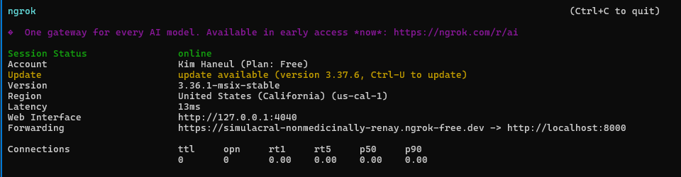
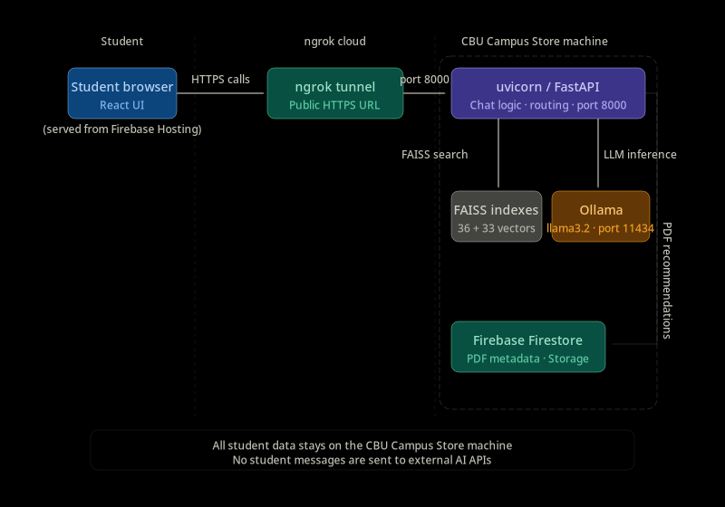

# Lance - Hosting Guide

> **Who this document is for:** IT staff and developers who need to understand how Lance is hosted, how the services connect, and what to do when something goes down. Read `01_IT_handoff.md` for day-to-day operational procedures. This guide focuses on the architecture and the migration plan.

---

## 1. Overview - what is being hosted and where

Lance has three separate hosting concerns, each running in a different location:

| Service | What it serves | Where it runs | Port |
|---|---|---|---|
| React frontend | The chat UI students see | Firebase Hosting (Google CDN) | 443 (HTTPS) |
| FastAPI backend | Chat logic, routing, FAISS retrieval | Local Campus Store machine (uvicorn) | 8000 |
| Ollama LLM | AI model inference | Local Campus Store machine | 11434 |
| ngrok tunnel | Connects backend to internet | ngrok cloud servers (interim) | N/A |

These are not interchangeable - each serves a distinct role. The frontend and backend are decoupled: the frontend is a static web app that runs in the student's browser and makes API calls to the backend. The backend and LLM must always run on the same local machine because Ollama communicates over localhost.

**Uptime requirements:**
- Firebase Hosting - managed by Google, essentially always up
- uvicorn backend - must be running for Lance to respond to any student
- Ollama - must be running for LLM fallback responses (FAQ direct answers still work without it)
- ngrok - must be running and connected for any student to reach the backend

---

## 2. Firebase Hosting - the React frontend

**What it is:**
Firebase Hosting is Google's static web hosting service. It serves the compiled React application (HTML, CSS, JavaScript) to student browsers via Google's global CDN. Load times are fast regardless of where students are connecting from.

**Project details:**
- Firebase project name: `lance-cbu`
- Firebase console: https://console.firebase.google.com/project/lance-cbu
- Hosting URL: shown in Firebase console under Hosting -> Dashboard
- Storage bucket: `lance-cbu.firebasestorage.app`

**What Firebase Hosting serves:**
- The chat UI (all React components)
- Static assets (CBU logo, Lance avatar image)
- The compiled JavaScript bundle

**What Firebase Hosting does NOT serve:**
- The backend API (that is uvicorn)
- PDF files (those are in Firebase Storage, not Hosting)
- The LLM responses (that is Ollama)

**How deployment works:**
```powershell
cd ui
npm run build
firebase deploy --only hosting
```
The `npm run build` command compiles the React app into static files in `ui/dist/`. The `firebase deploy` command uploads those files to Firebase's CDN. Changes are live within seconds.

**If the frontend goes down:**
Firebase Hosting has extremely high availability - Google guarantees 99.95% uptime. If the frontend is unreachable, check:
1. Is the Firebase project active? (`console.firebase.google.com`)
2. Was there a failed deployment that corrupted the hosted files? (Firebase console -> Hosting -> Release history -> roll back if needed)
3. Is the student's internet working?

Firebase downtime is extremely rare. Frontend issues are more commonly caused by a bad deployment than by Firebase itself.

---

## 3. Ollama - the local LLM

**What it is:**
Ollama is a tool that runs large language models locally on a machine. Lance uses it to run `llama3.2` - a 3 billion parameter language model - on the Campus Store machine. All AI inference happens on this machine with no data sent to external servers.

**Why it must stay local:**
FERPA compliance. Student questions must not be sent to external AI APIs (OpenAI, Anthropic, Google, etc.). Running the LLM locally via Ollama ensures all processing stays within CBU's infrastructure.

**Model:**
- Model name: `llama3.2`
- Model size: ~2GB on disk
- Stored at: `C:\Users\[username]\.ollama\models\`

**Port:** `11434` (local only - must not be exposed to the internet)

**How to verify Ollama is running:**
```powershell
curl http://localhost:11434/api/tags
```
Expected response: JSON listing available models including `llama3.2`.

**How to start Ollama:**
```powershell
ollama serve
```

**How to check which models are downloaded:**
```powershell
ollama list
```

**How to download the model if missing:**
```powershell
ollama pull llama3.2
```
This requires an internet connection and approximately 2GB of download.

**Performance note:**
On the current hardware (Ryzen 7 3800X, GTX 1080 Ti), LLM responses take 12-25 seconds. On the recommended hardware (Mac mini M4 Pro 48GB), this drops to 3-5 seconds. FAQ direct answers do not use Ollama and are always fast regardless of hardware.

**If Ollama crashes:**
FAQ and instruction answers continue working normally. Only the LLM fallback path is affected - students asking edge-case questions will receive escalation responses instead of AI-generated answers. Restart Ollama as soon as possible:
```powershell
ollama serve
```

---

## 4. uvicorn - the FastAPI backend

**What it is:**
uvicorn is an ASGI web server for Python. It runs the FastAPI application (`app/main.py`) and handles all incoming HTTP requests from the frontend.

**Port:** `8000`

**How to start in production:**
```powershell
conda activate campus-store-bot
cd C:\Users\[username]\Desktop\chatbot_cm
uvicorn app.main:app --host 0.0.0.0 --port 8000
```

**Production vs development mode:**
```powershell
# Development (auto-reloads on file changes - do NOT use in production)
uvicorn app.main:app --host 0.0.0.0 --port 8000 --reload

# Production (stable, no auto-reload)
uvicorn app.main:app --host 0.0.0.0 --port 8000
```
Always use the production command (without `--reload`) when running for students. The `--reload` flag watches the filesystem for changes and restarts the process automatically - this is useful during development but adds overhead and instability in production.

**What the startup output means:**
```text
Firebase initialized successfully       <- Firebase connection OK
   Project: lance-cbu
INFO: Application startup complete.     <- Server ready to accept requests
[QUEUE] Worker 1 started                <- Background job queue running
[QUEUE] Worker 2 started
```
If any of these lines are missing or show errors, the server did not start correctly.

**If uvicorn crashes:**
All students lose access to Lance immediately. Restart it following the startup procedure above. Check the terminal output for error messages - the most common cause is port 8000 already being in use from a previous process.

---

## 5. ngrok - the current interim tunnel

**What it is:**
ngrok is a tunneling service that creates a secure HTTPS connection between a public URL and a local port. Because the FastAPI backend runs on the Campus Store machine (not a public cloud server), it is not directly accessible from the internet. ngrok solves this by routing traffic through its servers.



**How to start ngrok:**
```powershell
ngrok http 8000
```

**What you will see:**
```text
Forwarding    https://abc123.ngrok-free.app -> http://localhost:8000
Web Interface http://localhost:4040
```

The `https://abc123.ngrok-free.app` URL is what the React frontend uses to reach the backend.

**Where this URL is configured:**
```text
ui/src/services/api.ts
```
Find the `API_BASE_URL` constant and update it when the ngrok URL changes.

**Free-tier limitations:**

| Limitation | Impact |
|---|---|
| URL changes every time ngrok restarts | Frontend must be updated and redeployed every time |
| Sessions expire after ~8 hours | ngrok must be restarted daily |
| Limited to 1 concurrent tunnel | Cannot run multiple tunnels simultaneously |
| Dependent on ngrok's servers | If ngrok has an outage, Lance is unreachable |

**When the ngrok URL changes:**
1. Note the new URL from the ngrok terminal output
2. Update `API_BASE_URL` in `ui/src/services/api.ts`
3. Rebuild and redeploy the frontend:
   ```powershell
   cd ui
   npm run build
   firebase deploy --only hosting
   ```

This is the most operationally disruptive aspect of the current setup. The permanent migration (Section 7) eliminates this problem entirely.

---

## 6. How the three services connect



**Traffic flow for a typical student question:**

1. Student types a message in the browser (React UI served from Firebase Hosting)
2. React sends a POST request to the ngrok HTTPS URL
3. ngrok forwards the request to port 8000 on the local machine
4. FastAPI (uvicorn) receives the request and runs routing logic
5. FAISS searches the local indexes for the best matching content (10-25ms)
6. If a direct answer is found: FastAPI returns it immediately
7. If LLM fallback is needed: FastAPI calls Ollama on localhost:11434 (3-25 seconds depending on hardware)
8. FastAPI checks Firestore for relevant PDF recommendations
9. Response is returned through ngrok back to the student's browser

**What breaks if each service goes down:**

| Service down | Effect on students |
|---|---|
| Firebase Hosting | Cannot load the chat UI at all |
| ngrok | Chat UI loads but no responses - connection error |
| uvicorn | Same as ngrok down - API unreachable |
| Ollama | FAQ and instruction answers still work; edge cases get escalation instead of AI response |
| Firestore | Chat works normally; PDF recommendations do not appear in sidebar |

---

## 7. The permanent migration plan - replacing ngrok

The ngrok tunnel is an interim solution. The permanent solution is a CBU IT-managed network configuration that gives the local machine a stable, public HTTPS address.

**What CBU IT needs to provide:**
1. Static IP address assigned to the Campus Store machine
2. DNS record pointing a hostname (for example, `lance.calbaptist.edu`) to that IP
3. SSL/TLS certificate for HTTPS
4. Firewall rule opening port 443 inbound

**Recommended setup on the Campus Store machine (nginx reverse proxy):**
```nginx
server {
    listen 443 ssl;
    server_name lance.calbaptist.edu;

    ssl_certificate /path/to/cert.pem;
    ssl_certificate_key /path/to/key.pem;

    location / {
        proxy_pass http://localhost:8000;
        proxy_set_header Host $host;
        proxy_set_header X-Real-IP $remote_addr;
        proxy_read_timeout 120s;
    }
}

server {
    listen 80;
    server_name lance.calbaptist.edu;
    return 301 https://$host$request_uri;
}
```

> **Important:** The `proxy_read_timeout 120s` is critical. Without it, nginx will cut off LLM responses mid-generation since they can take 25+ seconds on the current hardware.

**After migration - update the frontend:**
```text
ui/src/services/api.ts  ->  API_BASE_URL = "https://lance.calbaptist.edu"
```
Then rebuild and redeploy:
```powershell
cd ui
npm run build
firebase deploy --only hosting
```

**Migration checklist:**
- [ ] CBU IT assigns static IP to Campus Store machine
- [ ] DNS record created
- [ ] SSL certificate installed
- [ ] nginx installed and configured with correct timeout
- [ ] Port 443 open on machine firewall
- [ ] Frontend API URL updated and redeployed
- [ ] ngrok removed from startup procedure
- [ ] End-to-end health check passes (test chat from outside CBU network)

See `01_IT_handoff.md` Section 8 for the full detailed migration guide.

---

## 8. Docker containerization

The FastAPI backend is already containerized. Two files in the project root define the container:

```text
Dockerfile
docker-compose.yml
```

**How to start the backend with Docker instead of uvicorn directly:**
```powershell
docker-compose up
```

**How to stop:**
```powershell
docker-compose down
```

**When to use Docker vs uvicorn directly:**

| Situation | Use |
|---|---|
| Day-to-day operation on current Windows machine | uvicorn directly (simpler) |
| After IT migration to new hardware | Docker (more reliable, easier to manage) |
| After hardware upgrade to Mac | Docker (recommended for production) |

Docker containerization ensures the Python environment, dependencies, and configuration are consistent regardless of what else is installed on the machine. It also makes it easier to restart after a crash (Docker can be configured to auto-restart on failure).

**Timing recommendation:**
Switch from uvicorn-direct to Docker at the same time as the IT network migration. Doing both at once reduces the number of transitions.

---

## 9. Firebase project details

| Detail | Value |
|---|---|
| Project name | `lance-cbu` |
| Firebase console | https://console.firebase.google.com/project/lance-cbu |
| Storage bucket | `lance-cbu.firebasestorage.app` |
| Firestore database | Default database in `lance-cbu` project |
| Firestore collections | `pdf_documents`, `txt_to_pdf_map` |

**Who has admin access:**
The Google account used to create the Firebase project. If access is lost, the Firebase console has account recovery options. The service account key (`app/firebase-service-account.json`) provides programmatic access - keep this file secure.

**If Firebase access is lost:**
1. Go to `console.firebase.google.com`
2. Use Google account recovery if needed
3. Generate a new service account key: Project Settings -> Service Accounts -> Generate new private key
4. Replace `app/firebase-service-account.json` with the new key
5. Restart uvicorn

**Firebase free tier limits:**
Lance uses Firebase Hosting (free tier: 10GB storage, 360MB/day transfer) and Firestore (free tier: 1GB storage, 50K reads/day). Current usage is well within free tier limits. If student volume increases significantly, monitor usage in the Firebase console.

---

## 10. Uptime and recovery

**Expected uptime:**
- Firebase Hosting: ~99.95% (Google-managed)
- uvicorn + Ollama: depends on machine stability and whether auto-start is configured
- ngrok: degrades daily due to free-tier session limits

**Common causes of downtime:**

| Cause | How to detect | Fix |
|---|---|---|
| ngrok disconnected | Students report errors; ngrok terminal shows disconnected | Restart ngrok, check if URL changed |
| Machine restarted | All services down | Start all three services in order (Ollama -> uvicorn -> ngrok) |
| Ollama crashed | FAQ answers work, edge cases escalate | Restart Ollama |
| uvicorn crashed | All chat responses fail | Restart uvicorn |
| Port 8000 in use | uvicorn fails to start | Kill conflicting process, restart uvicorn |

**Setting up auto-start (strongly recommended):**
Configure Ollama and uvicorn to start automatically when the machine boots. This means after any planned or unplanned restart, Lance comes back online without manual intervention.

On Windows, this can be done using Task Scheduler:
1. Open Task Scheduler
2. Create a new task triggered "At startup"
3. Add two actions:
   - Action 1: `ollama serve`
   - Action 2: (after 10 second delay) `uvicorn app.main:app --host 0.0.0.0 --port 8000` in the project directory with conda environment activated
4. ngrok can also be added as a third action, though the URL change issue means the frontend may still need updating after a restart

On macOS (after hardware upgrade), use `launchd` service definitions for cleaner auto-start management.
