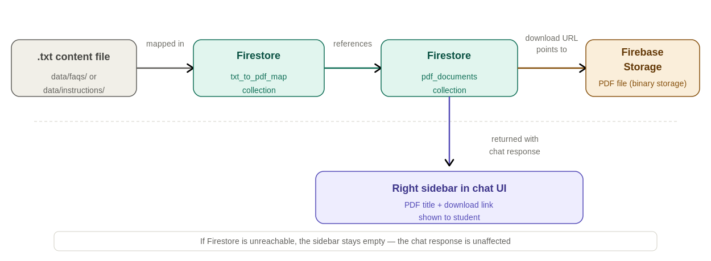

# Lance - Firestore PDF Guide

> **Who this document is for:** Developers and Campus Store staff who need to understand how PDF guides are stored, mapped, and displayed in Lance's right sidebar. The Admin UI handles most of this automatically - this guide explains what is happening under the hood and how to intervene manually if needed. Read `00_start_here.md` first if you have not already.

---

## 1. What this system does

When Lance answers a student's question, it checks whether there is a relevant PDF guide associated with the content it retrieved. If a PDF exists for that content, it appears in the right sidebar of the chat UI as a downloadable resource - a step-by-step guide the student can open alongside the chat response.

This is entirely supplemental. If Firebase is unreachable, or if no PDF is mapped to the retrieved content, the chat response works exactly the same. The PDF sidebar simply stays empty.

**Examples of when PDFs appear:**
- Student asks about accessing Cengage -> Lance returns Cengage access instructions -> Cengage PDF guide appears in sidebar
- Student asks about clearing browser cache -> Lance returns Chrome cache instructions -> Chrome cache clearing PDF appears in sidebar

**Examples of when no PDF appears:**
- Student asks about store hours -> no PDF is mapped to `campus_store_hours.txt` -> sidebar stays empty
- Firebase Storage is unreachable -> timeout after 5 seconds -> sidebar stays empty, chat still works

---

## 2. The two Firebase services involved



**Firebase Storage:**
Stores the actual PDF binary files. Each PDF has a download URL that students use to open or download the file. Storage is organized under the `lance-cbu.firebasestorage.app` bucket.

**Firestore:**
A NoSQL database that stores metadata about PDFs and the mapping between content files and PDFs. Firestore does not store the PDF files themselves - it stores the information needed to find them.

Lance uses two Firestore collections:

| Collection | Purpose |
|---|---|
| `pdf_documents` | One document per PDF - stores title, download URL, associated content filename |
| `txt_to_pdf_map` | Maps each `.txt` content filename to one or more PDF document IDs |

These two collections work together: when Lance retrieves `ia_cengage_mindtap_access.txt`, it looks up that filename in `txt_to_pdf_map`, finds the PDF document ID(s), then fetches those documents from `pdf_documents` to get the download URLs.

---

## 3. The Firestore data structure

### `pdf_documents` collection

Each document in this collection represents one PDF guide. The document ID is auto-generated.

**Example document:**
```text
Collection: pdf_documents
Document ID: abc123xyz

Fields:
  title:        "Cengage MindTap Access Guide"
  filename:     "cengage_access.pdf"
  download_url: "https://firebasestorage.googleapis.com/v0/b/lance-cbu..."
  source_file:  "ia_cengage_mindtap_access.txt"
  description:  "Step-by-step instructions for accessing Cengage MindTap"
  uploaded_at:  2026-01-15T10:30:00Z
```

### `txt_to_pdf_map` collection

Each document in this collection maps a `.txt` content filename to one or more PDF document IDs. The document ID is the `.txt` filename itself (without the path).

**Example document:**
```text
Collection: txt_to_pdf_map
Document ID: ia_cengage_mindtap_access.txt

Fields:
  pdf_ids: ["abc123xyz", "def456uvw"]
  source_file: "ia_cengage_mindtap_access.txt"
  updated_at: 2026-01-15T10:30:00Z
```

**Why two separate collections:**
The split allows one PDF to be mapped to multiple content files, and one content file to map to multiple PDFs. For example, a general "Immediate Access overview" PDF might be mapped to several FAQ files, while a platform-specific guide is mapped to only one instruction file.

---

## 4. How PDF recommendations are triggered

The full flow from student question to PDF appearing in the sidebar:

**Step 1 - Lance retrieves content:**
FAISS returns the best matching chunk and its `source_id` (for example, `INSTR_CENGAGE_SOURCE_0`). The routing logic maps this back to the original filename (`ia_cengage_mindtap_access.txt`).

**Step 2 - `get_recommendations_for_chat()` is called:**
This function in `app/pdf_recommendations.py` receives the source filename and looks it up in `txt_to_pdf_map` in Firestore.

**Step 3 - Firestore lookup:**
If a document exists in `txt_to_pdf_map` for that filename, `get_recommendations_for_chat()` fetches each PDF document ID from `pdf_documents`.

**Step 4 - Fallback to hardcoded map:**
If the Firestore lookup fails or returns nothing, the function checks a hardcoded `TXT_TO_PDF_MAP` dictionary in `pdf_recommendations.py` as a fallback.

**Step 5 - PDFs returned with response:**
The `recommended_pdfs` list is included in the `ChatResponse`. The React frontend reads this list and renders each PDF as a card in the right sidebar with a title and download link.

**Step 6 - Timeout protection:**
All Firestore calls use `timeout=5.0`. If Firestore is unreachable, the lookup fails silently within 5 seconds and `recommended_pdfs` is returned as an empty list. The chat response is not affected.

---

## 5. How to add a new PDF guide

### Method A - Admin UI (recommended for Campus Store staff)

This is the easiest method. The Admin UI handles Firestore entries automatically.

1. Go to `http://localhost:8000/admin`
2. Click the **Add Content** tab
3. Upload your `.txt` content file
4. In the PDF section, click **Add PDF** and upload the PDF file
5. Enter a label/title for the PDF
6. Click **Upload**

The Admin UI will:
- Save the `.txt` file to `data/faqs/` or `data/instructions/`
- Upload the PDF to Firebase Storage
- Create a document in `pdf_documents` with the title and download URL
- Create or update the `txt_to_pdf_map` entry linking the `.txt` filename to the new PDF document ID
- Rebuild the FAISS index

### Method B - Manual Firestore entry (for developers)

Use this when you need to add a PDF that was uploaded outside the Admin UI, or when you need to map an existing PDF to an additional content file.

**Step 1 - Upload the PDF to Firebase Storage:**
```python
from app.firebase_config import get_storage_bucket
bucket = get_storage_bucket()
blob = bucket.blob(f"pdfs/{pdf_filename}")
blob.upload_from_filename(local_pdf_path)
blob.make_public()
download_url = blob.public_url
```

Or upload manually through the Firebase console:
1. Go to `console.firebase.google.com` -> `lance-cbu` project
2. Storage -> Files -> Upload file
3. Copy the download URL after upload

**Step 2 - Create a `pdf_documents` entry:**
In the Firebase console -> Firestore -> `pdf_documents` collection -> Add document:
```text
title:        "Your PDF Title"
filename:     "your_pdf_filename.pdf"
download_url: "https://firebasestorage.googleapis.com/..."
source_file:  "your_content_file.txt"
description:  "Brief description"
uploaded_at:  (current timestamp)
```
Note the auto-generated document ID.

**Step 3 - Create or update the `txt_to_pdf_map` entry:**
In Firestore -> `txt_to_pdf_map` collection -> find or create a document with ID = your `.txt` filename:
```text
Document ID: your_content_file.txt

pdf_ids:     ["<document ID from step 2>"]
source_file: "your_content_file.txt"
updated_at:  (current timestamp)
```
If the document already exists (from a previous PDF), add the new document ID to the `pdf_ids` array.

---

## 6. How to remove a PDF guide

### Using the Admin UI (recommended)

1. Go to `http://localhost:8000/admin`
2. Click the **Remove Content** tab
3. Select the `.txt` file from the dropdown
4. Click **Remove**

The Admin UI will delete the `.txt` file, rebuild the FAISS index, and clean up the `txt_to_pdf_map` entry in Firestore. Note that the PDF file itself remains in Firebase Storage - delete it manually from the Firebase console if storage cleanup is needed.

### Manual cleanup

If a PDF needs to be removed without removing the associated `.txt` file:

1. Firebase console -> Firestore -> `txt_to_pdf_map`
2. Find the document for the relevant `.txt` file
3. Remove the PDF document ID from the `pdf_ids` array (or delete the document if it has no other PDFs)
4. Firebase console -> Firestore -> `pdf_documents`
5. Delete the document for the PDF being removed
6. Firebase console -> Storage -> Files
7. Delete the PDF file from Storage

---

## 7. The hardcoded fallback map

`app/pdf_recommendations.py` contains a hardcoded `TXT_TO_PDF_MAP` dictionary. This serves as a fallback when Firestore is unreachable or when a `.txt` file does not have a `txt_to_pdf_map` entry.

```python
TXT_TO_PDF_MAP = {
    "ia_cengage_mindtap_access.txt": ["cengage_access.pdf"],
    "ia_browser_cache_clear_chrome.txt": ["clear_cache_chrome_firefox.pdf"],
    # ... etc
}
```

**When this fallback is used:**
- Firestore is unreachable (network issue, Firebase outage)
- A `.txt` file was added directly to disk without going through the Admin UI
- The Firestore lookup returns no results for a file that should have PDFs

**When to update this map:**
Update it when adding new PDFs that should always be available even if Firestore is down. This is a developer task - edit `app/pdf_recommendations.py` directly.

**Important:** The hardcoded map uses PDF filenames, not Firestore document IDs. The function maps these filenames to download URLs using a separate lookup. If a PDF filename changes, update both the Firestore entry and the hardcoded map.

---

## 8. Firestore timeout and error handling

All Firestore `.get()` calls in `pdf_recommendations.py` use `timeout=5.0`:

```python
doc = db.collection("txt_to_pdf_map").document(source_filename).get(timeout=5.0)
```

This means if Firestore is unreachable, the PDF lookup fails within 5 seconds and returns an empty list. The chat response is returned to the student immediately - they just do not see PDF recommendations in the sidebar.

**If PDFs are never appearing in the sidebar:**

Run through this checklist:

1. **Is the `.txt` file mapped in Firestore?**
   Check Firebase console -> Firestore -> `txt_to_pdf_map` -> look for a document with the content filename as the ID

2. **Does the `pdf_documents` entry exist?**
   Check Firebase console -> Firestore -> `pdf_documents` -> look for the document ID referenced in `txt_to_pdf_map`

3. **Is the download URL valid?**
   Open the `download_url` from the `pdf_documents` entry in a browser - it should open or download the PDF

4. **Is Firestore reachable?**
   Check the uvicorn terminal for Firestore timeout warnings - look for `[WARN] PDF recommendation failed`

5. **Is the PDF in the hardcoded fallback map?**
   Check `app/pdf_recommendations.py` -> `TXT_TO_PDF_MAP` - if the file is listed there, PDFs should appear even without Firestore

6. **Was the source file retrieved?**
   In the uvicorn terminal, look for `[PDF] Recommending X PDFs` after a chat request - if it shows `0 PDFs`, the source file lookup found nothing
