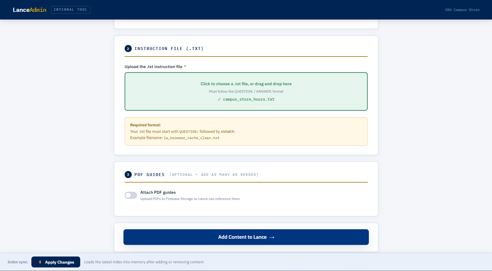
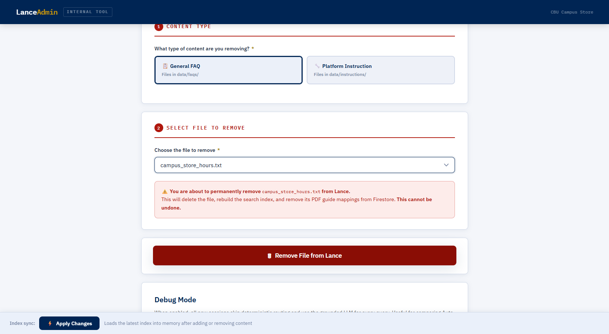

# Lance - Admin UI Guide

> **Who this document is for:** Campus Store staff and developers who manage Lance's content through the Admin UI. This is the day-to-day operational tool for adding, removing, and testing content without touching any code or the terminal. Read `02_campus_store_handoff.md` for broader context on Campus Store responsibilities.

---

## 1. What the Admin UI is

The Lance Admin UI is a browser-based internal tool built specifically for the CBU Campus Store team. It provides a visual interface for managing everything Lance knows - adding new FAQ answers, editing existing knowledge files, uploading PDF guides, archiving outdated content, reviewing feedback, and reloading the search index - all without opening a terminal or editing any code.

**When to use it:**
- A new type of student question needs an answer -> Add Content
- A policy changed and an existing answer is outdated -> Edit Content
- A PDF guide needs to be attached to a content file -> Add Content with PDF
- Content was added but Lance is not using it yet -> Apply Changes
- A response received a low rating -> Feedback

**When NOT to use it:**
- Fixing a routing bug that cannot be solved with content/config changes
- Restarting Ollama or uvicorn (requires IT and the terminal)
- Deploying frontend changes (requires Firebase CLI)
- Changing `.env` secrets (requires IT)

---

## 2. How to access it

**URL:**
```text
http://localhost:8000/admin
```

The Admin UI is only accessible when the Lance backend (uvicorn) is running on the local Campus Store machine. It is not accessible remotely - you must be on the same machine or network.

**Login:**
The Admin UI is protected by HTTP Basic Auth. When your browser prompts for credentials:
- Username: set in `.env` as `LANCE_ADMIN_USER` (default: `admin`)
- Password: set in `.env` as `LANCE_ADMIN_PASSWORD` - ask IT if you do not have it

**If the Admin UI is not accessible:**
1. Confirm the backend is running - open a terminal and check if uvicorn is active
2. If not running, contact IT to start it: `uvicorn app.main:app --host 0.0.0.0 --port 8000`
3. Confirm you are accessing from the correct machine or network
4. Try a hard refresh (`Ctrl+Shift+R`) if the page loads but looks broken

---

## 3. Add Content tab - walkthrough



The Add Content tab is used when you want Lance to know something new.

### Step 1 - Select content type

Two options:

| Content type | Use when |
|---|---|
| **General FAQ** | Store hours, policies, Immediate Access overview, return procedures, ordering info - any general question |
| **Platform Instruction** | Step-by-step access guides for a specific publisher platform (Cengage, McGraw Hill, Pearson, etc.) |

Choose General FAQ for most additions. Choose Platform Instruction only when adding a new platform-specific access guide.

### Step 2 - Upload the `.txt` file

Click **Choose File** and select your prepared `.txt` file. The file must follow the `QUESTION:` / `ANSWER:` format for FAQ files, or the standard instruction format for platform guides. See `04_dataset_guide.md` for format details.

The filename becomes the identifier for this content in Lance's system. Use the naming convention:
- `campus_store_{topic}.txt` for store information
- `ia_{platform}_{issue}.txt` for Immediate Access platform guides

### Step 3 - Attach PDF guides (optional)

If you have a PDF guide that should appear in the sidebar when this content is retrieved:

1. Click **Add PDF**
2. Select the PDF file from your computer
3. Enter a title for the PDF (this is what students see in the sidebar)
4. Repeat for additional PDFs if needed (up to 5 per content file)

If no PDF is attached, the content still works - the right sidebar will simply stay empty for this topic.

### Step 4 - Click Upload

Click the **Upload** button. The Admin UI will:
1. Save the `.txt` file to the appropriate directory (`data/faqs/` or `data/instructions/`)
2. Upload any attached PDFs to Firebase Storage
3. Create the Firestore `pdf_documents` and `txt_to_pdf_map` entries automatically
4. Rebuild the FAISS index to include the new content

**Wait for the success confirmation before leaving the page.** If an error appears, check that the backend is running and that the file format is correct.

### Step 5 - Apply Changes

After uploading, click the **Apply Changes** button at the bottom of the page to hot-reload the FAISS index into memory. Until you do this, the new content is on disk but Lance is not using it yet.

---

## 4. Edit Content tab - walkthrough

The Edit Content tab is used when a published `.txt` answer needs a wording, policy, or troubleshooting update.

### Step 1 - Select content type and file

Choose General FAQ or Platform Instruction, then select the file from the dropdown. Nested folder paths are shown when content is organized under subfolders.

### Step 2 - Edit text

Keep the YAML front matter at the top of the file. Required fields:

- `source_id`
- `source_type`
- `category`
- `platform`
- `issue_type`
- `priority`

### Step 3 - Validate

Click **Validate Content** before saving. Invalid YAML front matter or missing required metadata is rejected with a clear error.

### Step 4 - Save

Click **Save Content**. The Admin UI will:

1. Validate the file again
2. Create a timestamped backup under `data/_archive/backups/`
3. Save the edited `.txt` file
4. Rebuild the FAISS index

Click **Apply Changes** after saving, or restart the backend, so the running process loads the rebuilt index.

---

## 5. Remove Content tab - walkthrough



The Remove Content tab is used when content is outdated, incorrect, or no longer needed. Removed files are archived rather than permanently deleted.

### Step 1 - Open the dropdown

Click the dropdown selector. It shows all `.txt` files currently in Lance's content library - both FAQ files and instruction files. Scroll to find the file you want to remove.

### Step 2 - Select the file

Click the filename to select it. The selected file name appears in the field.

### Step 3 - Click Remove

Click the **Remove** button. The Admin UI will:
1. Move the `.txt` file into `data/_archive/removed/`
2. Rebuild the FAISS index without that file
3. Clean up the `txt_to_pdf_map` entry in Firestore for that file

**What is NOT automatically cleaned up:**
- The PDF binary files in Firebase Storage - these remain even after the content file is archived
- The `pdf_documents` entries in Firestore - these also remain

If you want to fully clean up a removed PDF, delete it manually from the Firebase console:
- Firebase console -> Storage -> Files -> delete the PDF
- Firebase console -> Firestore -> `pdf_documents` -> delete the document

### Step 4 - Apply Changes

Click **Apply Changes** to hot-reload the index. Until you do this, Lance may still return answers from the archived file.

---

## 6. Feedback tab - walkthrough

The Feedback tab is used to review student ratings and comments. Feedback is review-only data; it does not train the model or automatically change content.

### Filters

Use filters to find:

- Low ratings only
- A specific source label
- A specific date
- Unreviewed items
- Unresolved items

### Review actions

For each item, review the student message, Lance response, rating, optional comment, source label, confidence, and source file. Then:

- Mark Reviewed once a staff member has examined it
- Mark Resolved after a content, routing, or no-action decision is made
- Reopen if the item needs more work

See `docs/feedback-review-workflow.md` for the full triage process.

---

## 7. Apply Changes - the hot reload button

The **Apply Changes** button appears at the bottom of the Admin UI page. It is labeled "Index sync" with a lightning bolt icon.

**What it does:**
Calls the `/admin/reload-index` endpoint on the backend, which reloads the FAISS index from disk into memory without restarting uvicorn. This makes any content additions or removals live immediately.

**When to use it:**
Click Apply Changes after every Add, Edit, or Remove operation. If you make multiple content changes in a row, one Apply Changes at the end is sufficient.

**What to do if it fails:**
If the hot-reload fails, the page will show an error message with manual restart instructions:
```powershell
# In the conda-activated terminal on the server machine
# Stop uvicorn with Ctrl+C, then restart:
uvicorn app.main:app --host 0.0.0.0 --port 8000
```
Contact IT if you cannot access the terminal.

**Important:** Content changes written to disk persist across restarts. If you add a file and the server restarts before you click Apply Changes, the file is already on disk and will be picked up when the server comes back online - you do not need to re-upload.

---

## 8. What the Admin UI cannot do

The Admin UI covers content management. The following tasks are outside its scope:

| Task | How to do it instead |
|---|---|
| Fix a routing bug that content/config cannot solve | Developer updates routing logic or tests |
| Add a new publisher platform to detection/config | Developer updates `config/platforms.yaml` and ingestion config as needed |
| Restart Ollama or uvicorn | IT uses the terminal |
| Change admin username or password | IT edits `.env` file |
| Deploy frontend changes | Developer or staff with Firebase CLI runs `firebase deploy` |
| Update the FAQ sidebar options | Edit `ui/src/faqConfig.ts` and redeploy |
| View chat session logs | IT checks the uvicorn terminal output |
| Manage Firebase Storage or Firestore directly | Firebase console at `console.firebase.google.com` |
| Run the test suite | Developer runs `pytest -q` in the terminal |

---

## 9. CLI alternative

For developers who prefer working in the terminal, `lance_add_content.py` provides the same functionality as the Admin UI Add Content tab.

**Add a FAQ file with no PDF:**
```powershell
conda activate campus-store-bot
python lance_add_content.py --type faq --txt data/faqs/your_file.txt
```

**Add a FAQ file with one PDF:**
```powershell
python lance_add_content.py --type faq `
    --txt data/faqs/your_file.txt `
    --pdf docs/your_guide.pdf `
    --pdf-label "Your Guide Title"
```

**Add a FAQ file with multiple PDFs:**
```powershell
python lance_add_content.py --type faq `
    --txt data/faqs/your_file.txt `
    --pdf docs/guide1.pdf --pdf-label "Guide 1" `
    --pdf docs/guide2.pdf --pdf-label "Guide 2"
```

**Add a platform instruction file:**
```powershell
python lance_add_content.py --type instruction `
    --txt data/instructions/ia_newplatform_access.txt
```

After running the CLI script, the FAISS index is automatically rebuilt. Restart uvicorn or use the Admin UI Apply Changes button to load the new index into memory.
