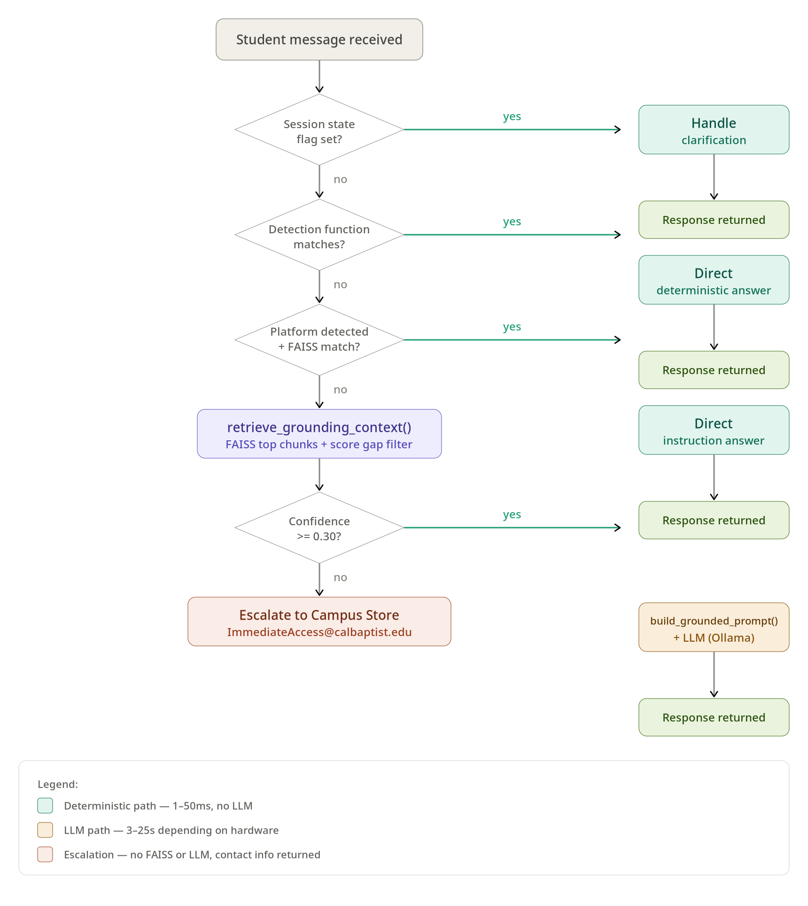

# Lance - Core Scripts Handoff Guide

> **Who this document is for:** Developers picking up the Lance codebase. This guide covers the two most important Python files - `app/main.py` and `app/llm/llama_client.py` - and the schema definitions in `app/schemas/chat.py`. Campus Store staff do not need to read this document. Read `03_rag_system.md` first for context on how retrieval works.

---

## 1. Overview - the two core scripts

**`app/main.py`** - 3700+ lines. This is the entire brain of Lance. It receives every student message, runs routing logic, retrieves content, calls the LLM when needed, manages session state, and returns responses. Almost every feature and bug in Lance lives in this file.

**`app/llm/llama_client.py`** - small and focused. Wraps the HTTP call to the Ollama API. Handles timeouts and basic error recovery. The rest of `main.py` calls this when it needs LLM inference.

**`app/schemas/chat.py`** - Pydantic models for request and response validation. Small but important - changing field names here breaks the frontend.

The long-term plan is to split `main.py` into modules (routing, session, retrieval, response). As of the current version this has not happened - everything is in one file. When navigating it, use `rg` or your editor's search to find function definitions by name.

---

## 2. `main.py` - what it does

`main.py` is a FastAPI application that:
1. Receives POST requests to `/chat` or `/chat/submit`
2. Gets or creates a session for the `session_id`
3. Runs the student's message through a cascade of detection functions
4. Retrieves the best matching content from FAISS
5. Returns a direct answer, or calls the LLM with grounded context
6. Returns a `ChatResponse` with the reply, source, confidence, timing, and PDF recommendations

Everything else in the system (FAISS indexes, Ollama, Firebase) is called from within this file.

---

## 3. The routing logic - how Lance decides what to do

The routing system is built on a pattern of **detection functions** - small functions that take the student's message as input and return `True` or `False`. Each function checks for a specific type of question using keyword matching.

**The pattern:**
```python
def is_browser_cache_issue(message: str) -> bool:
    m = (message or "").lower()
    cache_symptoms = [
        "0 courses",
        "0 materials",
        "no content available",
        # ...
    ]
    return any(s in m for s in cache_symptoms)
```

**Routing priority - most specific wins:**
The routing logic checks conditions from most specific to most general. The first matching condition returns a response. If nothing matches, the request falls through to the grounded LLM fallback.

Approximate priority order:
1. Session state flags (`awaiting_vitalsource_screen_confirm`, `awaiting_platform_type`, etc.) - handles multi-turn conversation state
2. Specific symptom detection (`is_browser_cache_issue`, `is_blank_page_query`, `is_vague_books_missing_query`)
3. Login/account issues (`is_login_account_issue`)
4. Out-of-scope queries (`is_out_of_scope_query`) - escalates to contact info
5. General IA program questions (`is_general_ia_question`, `is_access_code_question`, `is_ia_enrollment_query`)
6. Return/refund routing (`is_textbook_return_query`, `is_merchandise_return_query`, `is_technology_return_query`)
7. Platform detection -> platform-specific instruction retrieval
8. General FAQ retrieval
9. Grounded LLM fallback

**Complete routing function reference:**

| Function | Catches | Routes to |
|---|---|---|
| `is_browser_cache_issue()` | "0 courses 0 materials", cache symptoms | Browser-specific cache FAQ |
| `is_vague_books_missing_query()` | "my books aren't showing" | VitalSource screen clarification |
| `is_blank_page_query()` | "blank page", "link doesn't work" | VitalSource screen clarification |
| `is_login_account_issue()` | "shared my account", "can't log in" | Platform clarification |
| `is_out_of_scope_query()` | library, financial aid, Canvas, registrar | Escalation with contact info |
| `is_general_ia_question()` | IA program questions without platform | Grounded LLM fallback |
| `is_access_code_question()` | code-related questions | Grounded LLM fallback |
| `is_ia_enrollment_query()` | "is my book free", "included in IA" | Deterministic escalation |
| `is_textbook_return_query()` | textbook return/refund questions | `textbook_refund_policy.txt` |
| `is_merchandise_return_query()` | merchandise return questions | `campus_store_refund_merchandise.txt` |
| `is_technology_return_query()` | Apple/tech return questions | `campus_store_refund_technology.txt` |
| `is_merchandise_query()` | "what does the store sell" | `campus_store_merchandise.txt` |
| `is_opt_out_policy_question()` | opt-out policy questions | FAQ retrieval |
| `is_ia_overview_query()` | "what is immediate access" | `ia_overview.txt` |
| `is_store_hours_query()` | "what are the hours" | `campus_store_hours.txt` |
| `is_blackboard_location_query()` | "where is Blackboard" | Deterministic location response |
| `is_confirmed_materials_issue()` | vague textbook/materials questions | Platform clarification prompt |
| `is_ambiguous_class_access_query()` | "I can't access my class" | Class vs materials clarification |
| `detect_platform_from_text()` | platform names in message | Platform-specific FAISS index |

**When adding a new detection function:**
1. Add the function near other `is_*` functions (lines 1100-1800 approximately)
2. Add exclusions to `is_confirmed_materials_issue()` - this gate catches many queries if not excluded
3. Add exclusions to the IA continuity guard (search for `looks_like_ia_followup`)
4. Add the function to `detect_intent()` if it should override the intent classification
5. Run `pytest -q` to confirm no regressions

---

## 4. Session state - what gets remembered

Each session is a Python dictionary stored in memory. Sessions expire after inactivity (default: configured in `SESSION_TIMEOUT`). On machine restart, all sessions are lost - this is expected behavior.

**Key session fields:**

| Field | Type | Purpose |
|---|---|---|
| `history` | list | Conversation history (user + assistant turns) |
| `stored_platform` | str or None | Last confirmed platform (for example, `"CENGAGE"`) |
| `ia_context` | bool | True once a platform has been confirmed in this session |
| `stored_intent` | str or None | Last confirmed intent (`"IA_ACCESS_ISSUE"`, `"GENERAL_FAQ"`) |
| `awaiting_platform_type` | bool | True when Lance asked "which platform?" and waiting for answer |
| `awaiting_vitalsource_screen_confirm` | bool | True when Lance asked about the VitalSource error screen |
| `awaiting_class_access_clarification` | bool | True when Lance asked "class itself or materials?" |
| `awaiting_publisher_list_response` | bool | True when Lance showed the numbered publisher list |
| `awaiting_course_code` | bool | True when Lance asked for a course code |
| `ia_tab_missing_escalated` | bool | True after escalating a missing IA tab issue |
| `debug_mode` | bool | True when session is in LLM-only mode |
| `last_activity` | datetime | Used for session expiry |

**The IA continuity guard:**
When `ia_context` is True and `stored_platform` is set, subsequent messages in the same session reuse the stored platform without asking again. This prevents Lance from asking "which platform?" on every follow-up message. Detection functions that handle general (non-platform) questions are excluded from this guard - search for `looks_like_ia_followup` in `main.py` to find the full exclusion list.

**The `awaiting_*` flags:**
These flags implement multi-turn conversation flows. When Lance asks a clarifying question, it sets the corresponding flag. On the next message, the flag is checked before any routing runs - this ensures the student's response is interpreted as an answer to the clarification, not as a new question.

---

## 5. The three response paths



**Path 1 - Direct FAQ answer:**
FAISS retrieves a FAQ chunk with confidence above the threshold. `extract_faq_answer()` pulls the relevant portion. Response returned in 1-50ms. No LLM involved.

```text
Source tag: FAQ_SOURCE_XX
LLM time: 0.00ms (FAQ direct answer)
```

**Path 2 - Direct instruction answer:**
Platform is detected. The platform-specific FAISS index returns an instruction chunk. The full instruction text is returned as the response. Response returned in 1-50ms. No LLM involved.

```text
Source tag: INSTR_{PLATFORM}_SOURCE_XX
LLM time: 0.00ms (direct instruction)
```

**Path 3 - Grounded LLM fallback:**
No deterministic route matched. `retrieve_grounding_context()` queries FAQ and instruction indexes. If confidence >= 0.30, `build_grounded_prompt()` constructs a strict prompt with the retrieved context. Ollama generates a response constrained to that context. Response returned in 3-25 seconds depending on hardware.

```text
Source tag: FAQ_SOURCE_XX or LLM_GROUNDED
LLM time: XXXX ms (grounded RAG fallback)
```

**Escalation (not a response path - a guard):**
When the LLM fallback confidence is below 0.30, or when `is_out_of_scope_query()` fires, Lance returns a deterministic escalation message with contact information. No FAISS or LLM involved.

```text
Source tag: ESCALATION or LLM_ONLY
LLM time: 0.00ms (escalated)
```

---

## 6. Key helper functions

| Function | Location | What it does |
|---|---|---|
| `retrieve_async()` | top of `main.py` | Runs FAISS retrieval in a thread to avoid blocking the event loop |
| `retrieve_grounding_context()` | top of `main.py` | Retrieves top FAQ + instruction chunks for LLM grounding, applies score gap filter |
| `build_grounded_prompt()` | top of `main.py` | Constructs strict LLM prompt with retrieved context and no-hallucination rules |
| `extract_faq_answer()` | `main.py` | Extracts the ANSWER section from a FAQ chunk |
| `strip_meta_prefix()` | `main.py` | Removes `[META:...]` metadata headers from retrieved chunks |
| `strip_article_link_lines()` | `main.py` | Removes `Article link:` lines from retrieved content before returning to student |
| `detect_platform_from_text()` | `main.py` | Checks message against `platforms.yaml` keyword lists, returns platform key |
| `detect_recent_platform_from_history()` | `main.py` | Scans conversation history to recover platform context in multi-turn sessions |
| `get_or_create_session()` | `main.py` | Returns existing session or creates a new one with `init_session()` |
| `init_session()` | `main.py` | Creates a fresh session dictionary with all flags initialized to False/None |
| `cleanup_expired_sessions()` | `main.py` | Removes sessions inactive beyond `SESSION_TIMEOUT` |
| `build_browser_cache_faq_query()` | `main.py` | Returns the browser-specific FAISS query string for cache clearing |

---

## 7. The job queue system

Lance has two chat endpoints:

**`POST /chat`** - synchronous. Processes the request in the current async context. Used for most direct API calls and tests.

**`POST /chat/submit`** - asynchronous job queue. Submits the chat request to a background queue and returns a job ID immediately. The frontend polls for the result. Used by the React UI for non-blocking responses.

**Why the queue exists:**
LLM inference takes 3-25 seconds. Without the queue, the browser's HTTP connection would time out or block the UI. The queue allows the frontend to show a typing indicator while waiting.

**The semaphore:**
```python
MAX_CONCURRENT_LLM_REQUESTS = int(os.getenv("MAX_CONCURRENT_LLM_REQUESTS", "2"))
llm_semaphore = asyncio.Semaphore(MAX_CONCURRENT_LLM_REQUESTS)
```
At most 2 LLM requests run simultaneously. Additional requests queue until a slot opens. On the current hardware (25s LLM time), this limits throughput to ~5 LLM requests/minute. On the recommended hardware (4s LLM time), this becomes ~30 LLM requests/minute.

**Background workers:**
Two async workers process the job queue. They appear in the startup logs as `[QUEUE] Worker 1 started` and `[QUEUE] Worker 2 started`. If these do not appear, the queue is not running and the `/chat/submit` endpoint will not process requests.

---

## 8. `llama_client.py` - the LLM wrapper

`app/llm/llama_client.py` is a thin wrapper around the Ollama HTTP API.

**What it does:**
- Sends the grounded prompt to `http://localhost:11434/api/generate`
- Waits for the response with a configured timeout
- Returns the generated text string
- Raises an exception if Ollama is unreachable or times out

**Timeout configuration:**
```python
timeout=(5, 60)  # (connect_timeout, read_timeout) in seconds
```
- Connect timeout: 5 seconds - if Ollama does not accept the connection within 5 seconds, raise an error
- Read timeout: 60 seconds - if Ollama does not finish generating within 60 seconds, raise an error

**What happens when Ollama is not running:**
The `llm.chat()` call raises a `ConnectionRefusedError`. The grounded LLM fallback in `main.py` catches this and returns a fallback escalation message. FAQ direct answers and instruction answers are completely unaffected - they never call `llama_client.py`.

**The model name:**
`llama_client.py` sends `model: "llama3.2"` in the Ollama API request. If the model name changes (for example, upgrading to `llama3.2:11b`), update this value.

---

## 9. `app/schemas/chat.py`

Pydantic models that define the shape of API requests and responses.

**`ChatRequest`:**
```python
class ChatRequest(BaseModel):
    message: str
    session_id: str | None = None
```

**`ChatResponse`:**
```python
class ChatResponse(BaseModel):
    reply: str
    source: str
    article_link: Optional[str]
    confidence: float
    response_time_ms: Optional[float]
    retrieval_time_ms: Optional[float]
    llm_time_ms: Optional[float]
    total_time_ms: Optional[float]
    recommended_pdfs: List[Dict]
    debug_mode: bool = False
```

**The `source` field values:**

| Source value | Meaning |
|---|---|
| `FAQ_SOURCE_XX` | Direct FAQ answer from the FAQ FAISS index |
| `INSTR_{PLATFORM}_SOURCE_XX` | Direct instruction answer from a platform index |
| `CLARIFICATION_NEEDED` | Lance asked a clarifying question |
| `ESCALATION` | No relevant content - directed to contact info |
| `LLM_ONLY` | Generic escalation (legacy label) |
| `LLM_GROUNDED` | Grounded LLM fallback with no strong single source |
| `GENERAL_FAQ` | Deterministic FAQ response (enrollment, blackboard location, etc.) |

**If you add a new field to `ChatResponse`:**
The React frontend reads the `ChatResponse` JSON. Adding a new field with a default value is safe - the frontend ignores unknown fields. Removing or renaming an existing field that the frontend reads will break the UI.

---

## 10. What requires extreme caution

These sections of `main.py` are the most interconnected and the most likely to cause cascading failures if edited incorrectly.

**`is_confirmed_materials_issue()`:**
This is the catch-all gate for vague textbook questions. It triggers platform clarification when nothing more specific matched. Every new detection function that should bypass platform clarification must be added to this function's exclusion block. Missing an exclusion causes new detection functions to be silently overridden by this gate.

**The IA continuity guard (`looks_like_ia_followup`):**
This block reuses the stored platform for follow-up messages in an existing IA session. Every new detection function that handles general (non-platform) questions must be added to the exclusion list here. Missing an exclusion causes general questions in an active IA session to be misrouted to the stored platform's instructions.

**The `awaiting_*` flags:**
These flags must always be reset when their flow completes. If a flag is set but never cleared (due to an early return that skips the reset), subsequent messages in the same session will be misinterpreted indefinitely until the session expires.

**`retrieve_grounding_context()` and the score gap filter:**
The 0.15 score gap threshold determines whether the second retrieved chunk is kept or dropped. This value was tuned empirically. Lowering it causes topic contamination (wrong chunks polluting LLM context). Raising it causes the LLM to answer from less context. Do not change it without testing the impact across multiple query types.

**`MAX_CONCURRENT_LLM_REQUESTS` and `llm_semaphore`:**
Raising the semaphore limit without a hardware upgrade will cause LLM responses to slow down, not speed up - the hardware cannot parallelize inference effectively on the current machine. Only raise this limit after the hardware upgrade to Apple Silicon.
